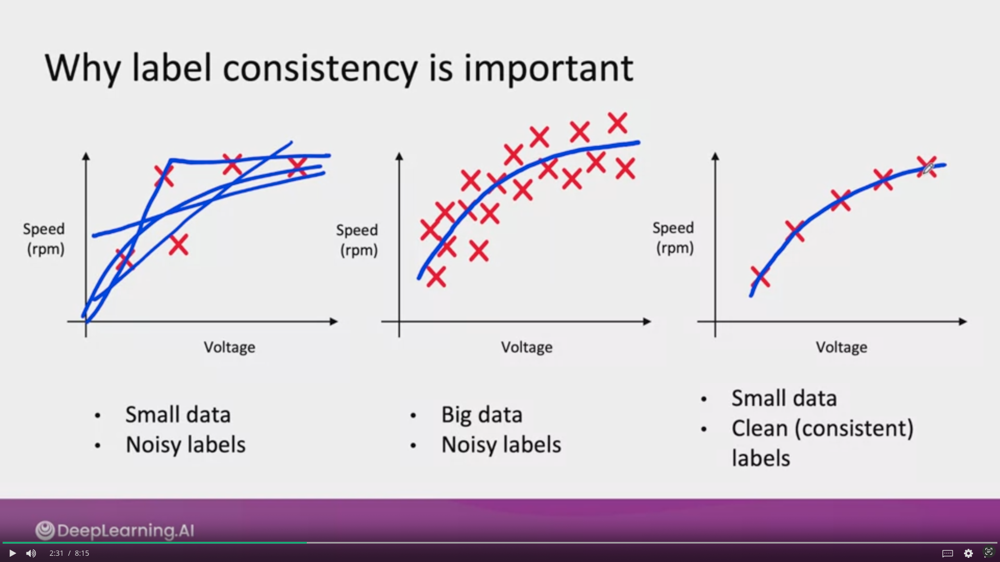
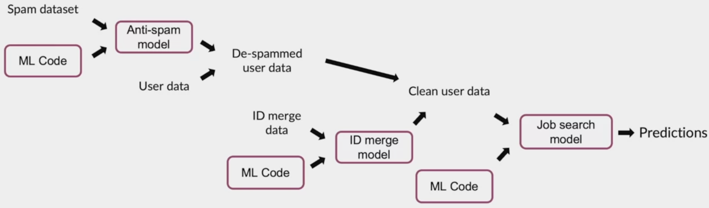

# Introduction to ML in Production

```
I am writing to apply for financial assistance to attend a course on MLOps. As a recent graduate in Artificial Intelligence Engineering, I have discovered a deep passion for machine learning and data science, and I firmly believe that this course presents a valuable opportunity to further enhance my knowledge in this emerging field.

As an ambitious professional, I understand the growing importance of MLOps in effectively implementing and managing machine learning models in production. This course will provide me with practical skills to integrate MLOps principles into my current and future projects. I aspire to become a proficient MLOps practitioner, capable of developing, deploying, and monitoring large-scale machine learning systems.

However, due to financial constraints, I am unable to cover the expenses associated with this course. Receiving financial assistance would enable me to overcome this hurdle and actively participate in this high-quality training.

I am committed to fully leveraging this opportunity and sharing the knowledge gained with my colleagues and the community. I firmly believe that this investment in my education will have a positive long-term impact on my career and allow me to make meaningful contributions to the field of MLOps.

Thank you sincerely for your consideration and the opportunity to receive your financial support to pursue this training endeavor. I am confident that my determination, passion, and dedication to the field of MLOps make me a suitable candidate for this assistance.

Yours faithfully,
```
***
## Week 1
MLOps (Machine Learning Operations) is an emerging discipline, and comprises a set of tools and principles to support progress through the ML project lifecycle


* Concept drift or data drift: when the data input changes after the model is deployed
    * Training set: purchased data, historical  user data with transcripts
    * Test set: data from a few months ago 
* How has the data changed ? 
* When a model is deployed, one of the most important tasks is to be make sure you can detect and manage any changes

## !! Software engineering issues !!
Checklist of questions
* Type of prediction?: Realtime or Batch 
* Cloud vs Edge/Browser
* Compute resources (CPU/GPU/memory)
* Latency, throughput (QPS Query per seconds)   500ms, 1000QPS 
* Logging
* Security and privacy
***
### ML project Lifcycle!


## Example case: Speech recognition


* **Data stage:** define the data 
    * is the data labeled consistently ? 
    * How much silence before/after each clip ? 
    * How to perform volume normalization ? 
* **Modeling stage:** 
* Deplyoment stage:


## Common deployment cases 
* New product/capability
* Automate/assist with manual task 
* Replace previous ML system

***
## Shadow mode: 
Verifier si le model donne des predictions correctes en comparaison avec un jugement humain. L'output est seulement affiché pour analyser. Ce n'est pas lui qui fait le jugement final


## Canary deployment 
When you are ready to let a learning algorithm start making real decisions, a common deployment pattern is Canary deployment.
* Roll out to small fraction (5%) of traffic initially 
* Monitor system and ramp up traffic gradually

## Blue green deployment 
All the data input for the prediction will spin up suddenly the old prediction service (Old/Blue version) to a new prediction service (New/Green version) of your learning algorithm.
> Advantages is that you can easily rollback to your old version. If something goes wrong, you can just very quickly have the router go back. Reconfigure the router to your blue version

## Degrees of automation
Example of scratch detection:


***
# Monitoring
## Dashboard

* Brainstorm the things that could go wrong
* Brainstorm a few statistics/metrics that will detect the problem 
* it is ok to use many metrics initially and gradually remove the ones you find not useful
* **
* Set thresholds for alarms
* Adapt metrics and thresholds over time 

*** 
* Manual retraining (most common)
* Automatic retraining 

## Examples of metrics to track: 
* Software metrics:
    * Memory, compute, latency, throughput, server load...
* Input metrics (X):
    * Avg input length 
    * Avg input volume
    * Num missing values
    * Avg image brightness
* Output metrics (Y):
    * #times return " " (null)
    * #times user redoes search
    * #times user switches to typing
    * CTR

### Just as ML modeling is iterative, so is deployment...

Deployment/Monitoring -> Traffic -> Performance Analysis -> deployment/monitoring ...

> Iterative process to choose the right set of metrics to monitor

## Pipeline Monitoring 
> Monitoring multiple learning algorithm

##### Speech recognition example:
Audio  -> **VAD (Voice Activity Detection)** -> **Speech recognition** -> transcript

Two learning algorithm

##### User profile example:
User Data (e.g. clickstream) -> **User Profile** (e.g. own car?) -> **Recommander system** -> Product recommendations

 Two learning algorithm

### Metrics to monitor
##### How quickly do they change ? 
* User data generally has slower drift (they are some exceptions like COVID 19)
* Enterprise data (B2B applications) can shift fast

***
### Establish a baseline level of performance 


Ways to establish baseline: 
* Human level performance (HLP)
* Literature search for state-of-the-art/open source
* Quick-and-dirty implementation
* Performance of older system 

>Baseline helps to indicates what might be possible. In some cases (such as HLP) is also gives a sense of what is irreducible error/Bayes error. 

> The avg results of test set is not enough to say that your model is good. You need to check all of the result of your predictions and do a HLP to be sure. 

## Tips for getting started on ML project
Article: 
* [Establish a Baselines](https://blog.ml.cmu.edu/2020/08/31/3-baselines/)
* [Error analysis](https://techcommunity.microsoft.com/t5/ai-machine-learning-blog/responsible-machine-learning-with-error-analysis/ba-p/2141774)
* [Experiment tracking](https://neptune.ai/blog/ml-experiment-tracking)

***
## Summary 
1. Getting started on modeling 
2. Error analysis
3. Auditing framework
4. Data augmentation
5. Adding features
6. Establish a baseline
7. Experiment tracking 
8. From big data to good data 


***
#### ML is an iterative process 
Model + hyperparameters + data -> Training -> Error analysis -> ...

### Getting started on modeling 
* Literature search to see what's possible (courses, blogs, open-source projects). 
* Find open-source implementations if available 
* A reasonable algorithm with good data will often outperform a great algorithm with no so good data

## Sanity-check for code and algorithm 
* Try to overfit a small training dataset before training on a large one. 
    * If it's doesn't work, try to debug hyperparameters/models etc. before training on a larger dataset

***
## Error analysis and performance auditing 
* Segment different tags and do brainstorming 

#### Prioritizing what to work on 

In this example, work on `clean speech` and `people noise` will be more effective for the speech recognition system

* #### Decide on most important categories to work on based on:
    * How much Room for improvement there is 
    * How frequently that category appears
    * How easy is to improve accuracy in that category 
    * How important it is to improve in that category 

#### Adding/improving data for specific categories 
* For categories you want to prioritize: 
    * Collect more data 
    * Use data augmentation to get more data 
    * Improve label accuracy/data quality

### Skewed dataset
> Datasets where the ratio of positive to negative examples is very far from 50-50 (97% of positive and 3% of negative)

Examples: 
* Manufacturing example
    * 99.7% no defect    y=0
    * 0.3% defect        y=1
* Medical diagnosis example:
    * 99% of patients don't have a disease
* Speech recognition example:
    * In wake word detection ("Ok google", "Alexa"..), 96.7% of the time wake word doesn't occur

    
#### Confusion matrix: Precision and Recall


| Predicted / Actual | y = 0  | y = 1 |
|--------------------|:-------|-------|
| y = 0              | **905 TN** | **18 FN** |
| y = 1              | **9 FP**   | **68 TP** |

*TN: True Negative*
*TP: True Positive*
*FN: False Negative*
*FP: False Positive*

Precision = TP / (TP + FP) = 68 / (68 + 9) = **88.3%**

Recall = TP / (TP + FN) = 68 / (68 + 18) = **79.1%** 

## Combining precision and recall - F1 score

| Model    | Precision (P) | Recall (R) | F1        |
|----------|---------------|------------|-----------|
| Model 1  | 88.3          | 79.1       |   **83.4%**   | 
| Model 2  | 97.0          | 7.3        |   **13.6%**   |

F1 = 2 / ((1/P) + (1/R)) 


### auditing framework 
Check for accuracy, fariness/bias, and other problems. 
1. Brainstorm the ways the system might go wrong 
    * Performance on subsets of data (e.g. ethnicity, gender)
    * How common are certain errors (e.g., FP, FN)
    * Performance on rare classes
2. Establish metrics to assess performance against these issues on appropriate slices of data 
3. Get business/product owner buy-in

###### Example: Speech recognition example
1. Brainstorm the ways the system might go wrong
    * Accuracy on different gender and ethnicities
    * Accuracy on different devices
    * Prevalence of rude mis-transcriptions (GANs -> gun or gang) 
2. Establish metrics to assess performance against these issues on appropriate slices of data 
    1. Mean accuracy for diffenrent genders and major accents 
    2. Mean accuracy on different devices
    3. Check for prevalence of offensive words in the output


> There is MLOps tools to do these, such as tensorflow model analysis

## Data augmentation


**Goal:** Create realistic examples that (i) the algorithm does poorly on, but (ii) humans (or other baseline) do well on 

**Checklist:**
    * Does it sound realistic ? 
    * is the x -> y mapping clear? (e.g., can humans recognize speech?)
    * is the algorithm currently doing poorly on it? 

#### Data iteration loop 
Add/improve data (holding model fixed) -> Training -> Error analysis

## Can adding data hurt performance ? 
### For unstructured data problems, if: 
* The model is large (low bias)
* The mapping x -> y is clear (e.g., given only the input x, humans can make accurate predictions)

Then, **adding data rarely hurts accuracy.** 

## Adding features

#### Structured data 
Restaurant recommendation example;
Vegetarians are frequently recommended restaurants with only meat options

**Possible features to add?** 
* Is person vegetarian (based on past orders)? 
* Does restaurant have vegetarian options (based on menu)? 

#### What are the added features that can help make a decision?
Product recommendation: 
    Collaboration filtering -> Content based filtering (Cold-start)
    
### Data iteration for structured data
Model (add features) -> Training -> Error Analysis

* Error analysis: 
    * can be harder if there is no good baseline (such as HLP) to compare to. 
    * user feedback and benchmarking to competitors can all provide inspiration for features to add. 


# Experiment tracking 

* ### What to track? 
    * Algorithm/code versioning 
    * Dataset used
    * Hyperparameters
    * Results


* ### Tracking tools
    * Text files 
    * Spreadsheet
    * Experiment tracking system

* ### Desirable features
    * Information needed to replicate results 
    * Experiment results, ideally with summary metrics/analysis
    * Perhaps also: Resource monitoring, visualization, model error analysis


## From Big data to **Good data** 
Try to ensure consistently high-quality data in all phases of the ML project lifecycle

**Good data:** 
* Covers important cases (good coverage of inputs X)
* Is defined consistently (definition of labels Y is unanmbiguous) 
* Has timely feedback from production data (distribution covers data drift and concept drift)
* Is sized approprialy 

***

# Summary Week3 

## Define Data and Establish baseline
### Define your data right 
The data you use for your learning algorithm is the most important things for the efficency of it. For example, in computer vision, the way the bounding box is placed will be an important factor to 
### More label ambiguity examples
#### Data definition questions
* What is the input x?
    * Lighting? Contrast? Resolution?
    * What features need to be included? 
* What is the target label y?
    * How can we ensure labelers give consistent labels? 
    
### Major types of data problems

|                        | Unstructured                                               | Structured                                                                       |
|------------------------|------------------------------------------------------------|----------------------------------------------------------------------------------|
| Small data (<= 10 000) | Manufacturing visual inspection from 100 training examples | Housing price prediction based on square footage, etc. from 50 training examples |
| Big data (>10 000)     | Speech recognition from 50 million training examples       | Online shopping recommendations for 1 million users                              |

* **Unstructured** 
    * Humans can label data. 
    * Data augmentation 
* **Structured** 
    * Harder to obtain more data 
* **Small data**
    * Clean labels are critical. 
* **Big data** 
    * Emphasis on data process

#### Unstructured vs. Structured data
**Unstructured data**
* May or may not have huge collection of unlabeled examples x.
* Humans can label more data
* Data augmentation more likely to be helpful

**Structured data**
* May be more difficult to obtain more data. 
* Human labeling may not be possible (with some exceptions)

#### Small vs. Big data
**Small data (<= 10 000)** 
* Clean labels are critical 
* Can manually look through dataset and fix labels
* Can get all the labelers to talk to each other 

**Big data (> 10 000)** 
* Emphasis data process 

### Small data and label consistency



#### Big data problems can have small data challenges too 
Problems with a large dataset but where there's a long tail of rare events in the input will have small data challenges too. 
* Web search 
* Self-driving cars
* Product recommendation systems

### Improving label consistency 
* Have multiple labelers label same example
* When there is disagreement, have MLE, subject matter expert (SME) and/or labelers discuss definition of y to reach agreement.
* if labelers believe that x doesn't contain enough information consider changing x.
* Iterate unitl it is hard to significantly increase agreement 

#### Examples 
* **Standardize labels** 
"Um, nearest gas station" 
"Umm, nearest gas station"                ===> **"Um, nearest gas station"** 
"Nearest gas station [unintelligible]"
 
 * **Merge classes**
 
 Deep scratch or Shallow scratch (on iphone)  ===> **Scratch**
 
 #### Have a class/label to capture uncertainty
 * Defect: 0 or 1 
 
=> *Alternative:* 0, Borderline, 1

* Unintelligible audio 
"Nearest go"
"Neareast grocery"
"Nearest **[unintelligible]**" <- 

#### Small vs. Big data (unstructured data) for label consistency 
* **Small data**
    * Usually small number of labelers
    * Can ask labelers to discuss specific labels. 
* **Big data** 
    * Get to consistent definition with a small group 
    * Then send labeling instructions to labelers 
    * Can consider having multiple labelers label every example and using voting or consensus labels to increase accuracy 


## Human Level Performance (HLP)
### Why measure HLP? 
Estimate Bayes error / irreducible error to help with error analysis and prioritization

### Other uses of HLP 
* In academia, establish and beat a respectable benchmark to support publication. 
* Business or product owner asks for 99% accuracy. HLP helps establish a more reasonable target 
* "Prove" the ML system is superior to humans doing the job and thus the business or product owner should adopt it **(<- use with caution)**

### The problem with beating HLP as a "proof" of ML "superiority"

"Hm... nearest gas station" <- 70% of labelers
"Um, nearest gas station" <- 30% 

Two random labelers agree: 0.7**2 + 0.3 **2 = **0.58**
ML agrees with humans: 0.7

The 12% better performance is not important for anything! This can also mask more significant errors ML may be making.

### Raising HLP
When the ground truth label is externally defined (e.g. biopsy), HLP gives an estimate for Bayes error / irreducible error. 
But often ground truth is just another human label. 


 | Scratch length (mm) | Ground Truth Label | Inspector |
|:--------------------|--------------------|-----------|
| 0.7                 | 1                  | 1         |
 | 0.2                 | ~~1~~    0              | 0         |
 | 0.5                 | 1                  | 1         |
 | 0.2                 | 0                  | 0         |
 | 0.1                 | 0                  | 0         |
 | 0.1                 | 0                  | ~~1~~   0      |

**0.3 mm**: 66.7% -> 100%

* When the label Y comes from a human label, HLP << 100% may indicate ambiguous labeling instructions
* Improving label consistency will raise HLP 
* This makes it harder for ML to beat HLP. But the more consistent labels will raise ML performance, which is ultimately likely to benefit the actual application performance. 

### HLP on structured data
Structured data problems are less likely to involve human labelers, thus HLP is less frequently used

Some exceptions: 
* User id merging: Same person?
* Based on network traffic, is the computer hacked? 
* Is the transaction fraudulent?
* Spam account? Bot? 
* From GPS, what is the mode of transportation - on foot, bike, car, bus?

## Label and Organize data 
### Obtaining data 
#### How long should you spend obtaining data?

Model+Hyperparameters+ Data (**~~30days~~ 2 days**) -> Training (2 days) -> Error analysis (2days) 

* Get into this iteration loop as quickly possible.
* Instead of asking: How long it would take to obtain m examples? Ask: How much data can we obtain in k days.
* Exceptions: If you have worked on the problem before and from experience you know you need m examples

#### Inventory data
Brainstorm list of data sources (for example speech recognition)


| Source                 | Amount | Cost   | Time    |
|------------------------|--------|--------|:--------|
| Owned                  | 100h   | 0$     | 0       |
| Crowdsourced - Reading | 10000h | 10000$ | 14 days |
| Pay for labels         | 100h   | 6000$  | 7 days  |
| Purchase data          | 1000h  | 10000$ | 1 days  |

> Other factors: Data quality, privacy, regulatory constraints

#### Labeling data
* Options: In-house vs. outsourced vs. crowdsourced 
* Having MLEs label data is expensive. But doing this for just a few days is usually fine. 
* Who is qualified to label?
    * Speech recognition - any reasonably fluent speaker
    * Factory inspection, medical image diagnosis - SME(subject matter expert)
    * Recommender systems - maybe impossible to label well
* Don't increase data by more than 10x at a time

### Data pipeline
#### Example - Job search
X = user info 
Y = looking for job

**raw data** => **Data cleaning**[spam cleanup + user ID merge] => **ML** => y 

* **Development**
    * Data -> Preprocessing scripts -> ML -> Test set performance
* **Production**
    * New data -> **Replicate scripts** -> ML -> Product

How to replicate "Replicate scripts" ?

#### POC and Production phases
POC (proof-of-concept):
* Goal is to decide if the application is workable and worth deploying
* Focus on getting the prototype to work!
* it's ok if data pre-processing is manual. But take extensive notes/comments.

Production phase:
* After project utility is established, use more sophisticated tools to make sure the data pipeline is replicable 
* E.G. Tensorflow transform, Apache Beam, Airflown, ...

### Meta data, data provenance and lineage
#### Example 
Task: Predict if someone is looking for a job (x=user data, y=looking for a job?)


Keep track of **data provenance**(where it comes from) and **lineage** (sequence of steps) 

### Meta-data 
**Examples:**
* Manufacturing visual inspection: Time, factory, line #, camera settings, phone model, inspector ID, ...
* Speech recognition: Device type, labeler ID, VAD model ID,...

**Useful for:** 
* Error analysis. Spotting unexpected effects
* Keeping track of data provenance

### Balanced train/dev/test splits in small data problems
* Visual inspection exampl: 100 examples, 30 positive (defective)

Train/dev/test: 60% / 20% / 20%
Random split: 21 / 2 / 7  positive example (35% 10% 35%)

Want: 18 / 6 / 6 -> (30% / 30% / 30%) Balanced split

> No need to worry about this with **large datasets** - a random split will be representative. 