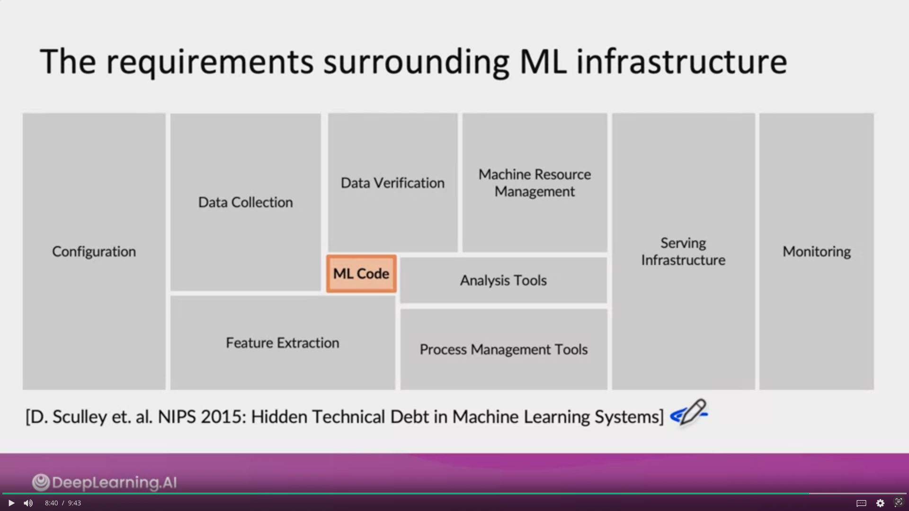
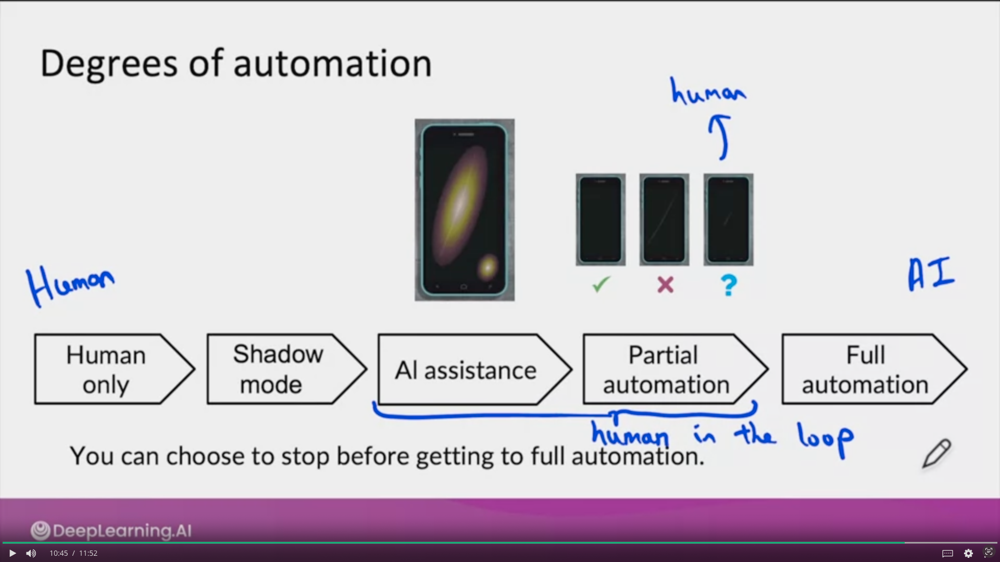
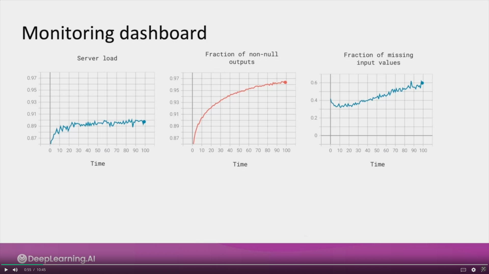

# Introduction to ML in Production

```
I am writing to apply for financial assistance to attend a course on MLOps. As a recent graduate in Artificial Intelligence Engineering, I have discovered a deep passion for machine learning and data science, and I firmly believe that this course presents a valuable opportunity to further enhance my knowledge in this emerging field.

As an ambitious professional, I understand the growing importance of MLOps in effectively implementing and managing machine learning models in production. This course will provide me with practical skills to integrate MLOps principles into my current and future projects. I aspire to become a proficient MLOps practitioner, capable of developing, deploying, and monitoring large-scale machine learning systems.

However, due to financial constraints, I am unable to cover the expenses associated with this course. Receiving financial assistance would enable me to overcome this hurdle and actively participate in this high-quality training.

I am committed to fully leveraging this opportunity and sharing the knowledge gained with my colleagues and the community. I firmly believe that this investment in my education will have a positive long-term impact on my career and allow me to make meaningful contributions to the field of MLOps.

Thank you sincerely for your consideration and the opportunity to receive your financial support to pursue this training endeavor. I am confident that my determination, passion, and dedication to the field of MLOps make me a suitable candidate for this assistance.

Yours faithfully,
```
***
## Week 1
MLOps (Machine Learning Operations) is an emerging discipline, and comprises a set of tools and principles to support progress through the ML project lifecycle



* Concept drift or data drift: when the data input changes after the model is deployed
    * Training set: purchased data, historical  user data with transcripts
    * Test set: data from a few months ago 
* How has the data changed ? 
* When a model is deployed, one of the most important tasks is to be make sure you can detect and manage any changes

## !! Software engineering issues !!
Checklist of questions
* Type of prediction?: Realtime or Batch 
* Cloud vs Edge/Browser
* Compute resources (CPU/GPU/memory)
* Latency, throughput (QPS Query per seconds)   500ms, 1000QPS 
* Logging
* Security and privacy
***
### ML project Lifcycle!


## Example case: Speech recognition


* **Data stage:** define the data 
    * is the data labeled consistently ? 
    * How much silence before/after each clip ? 
    * How to perform volume normalization ? 
* **Modeling stage:** 
* Deplyoment stage:


## Common deployment cases 
* New product/capability
* Automate/assist with manual task 
* Replace previous ML system

***
## Shadow mode: 
Verifier si le model donne des predictions correctes en comparaison avec un jugement humain. L'output est seulement affiché pour analyser. Ce n'est pas lui qui fait le jugement final


## Canary deployment 
When you are ready to let a learning algorithm start making real decisions, a common deployment pattern is Canary deployment.
* Roll out to small fraction (5%) of traffic initially 
* Monitor system and ramp up traffic gradually

## Blue green deployment 
All the data input for the prediction will spin up suddenly the old prediction service (Old/Blue version) to a new prediction service (New/Green version) of your learning algorithm.
> Advantages is that you can easily rollback to your old version. If something goes wrong, you can just very quickly have the router go back. Reconfigure the router to your blue version

## Degrees of automation
Example of scratch detection:



***
# Monitoring
## Dashboard

* Brainstorm the things that could go wrong
* Brainstorm a few statistics/metrics that will detect the problem 
* it is ok to use many metrics initially and gradually remove the ones you find not useful
* **
* Set thresholds for alarms
* Adapt metrics and thresholds over time 

*** 
* Manual retraining (most common)
* Automatic retraining 

## Examples of metrics to track: 
* Software metrics:
    * Memory, compute, latency, throughput, server load...
* Input metrics (X):
    * Avg input length 
    * Avg input volume
    * Num missing values
    * Avg image brightness
* Output metrics (Y):
    * #times return " " (null)
    * #times user redoes search
    * #times user switches to typing
    * CTR

### Just as ML modeling is iterative, so is deployment...

Deployment/Monitoring -> Traffic -> Performance Analysis -> deployment/monitoring ...

> Iterative process to choose the right set of metrics to monitor

## Pipeline Monitoring 
> Monitoring multiple learning algorithm

##### Speech recognition example:
Audio  -> **VAD (Voice Activity Detection)** -> **Speech recognition** -> transcript

Two learning algorithm

##### User profile example:
User Data (e.g. clickstream) -> **User Profile** (e.g. own car?) -> **Recommander system** -> Product recommendations

 Two learning algorithm

### Metrics to monitor
##### How quickly do they change ? 
* User data generally has slower drift (they are some exceptions like COVID 19)
* Enterprise data (B2B applications) can shift fast

***
### Establish a baseline level of performance 


Ways to establish baseline: 
* Human level performance (HLP)
* Literature search for state-of-the-art/open source
* Quick-and-dirty implementation
* Performance of older system 

>Baseline helps to indicates what might be possible. In some cases (such as HLP) is also gives a sense of what is irreducible error/Bayes error. 

> The avg results of test set is not enough to say that your model is good. You need to check all of the result of your predictions and do a HLP to be sure. 