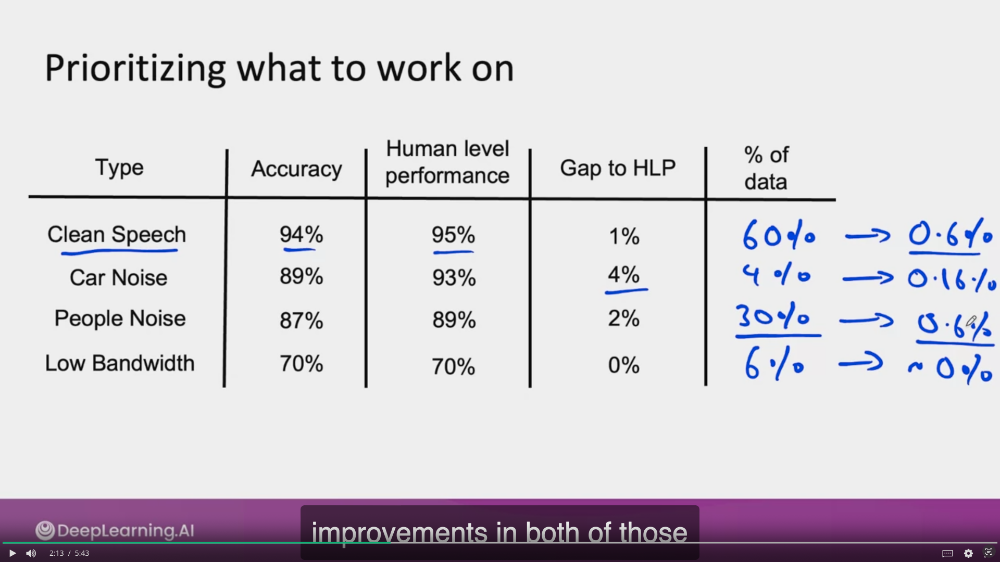
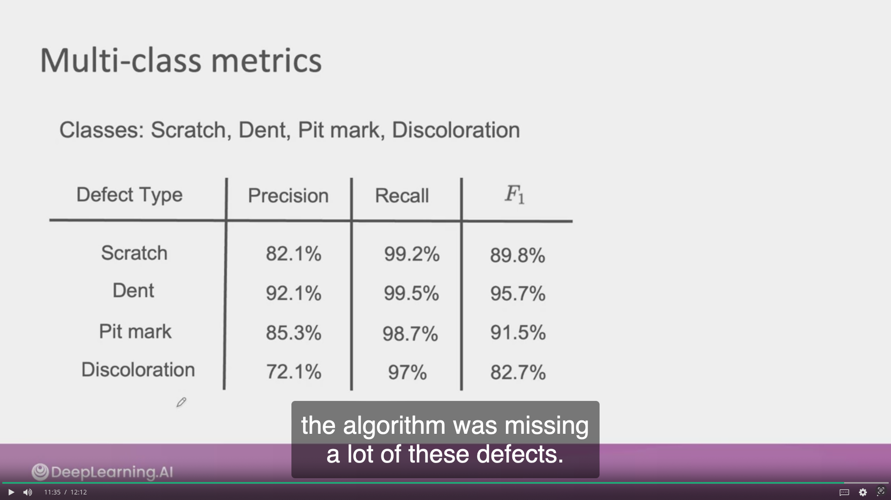
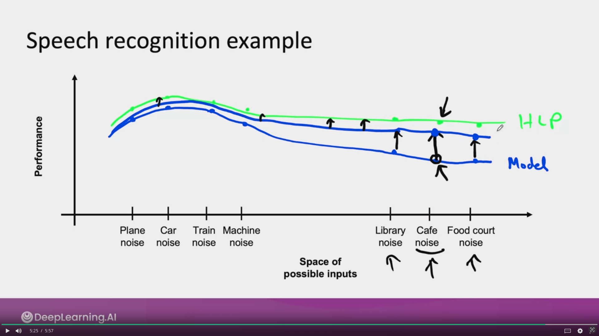

## Tips for getting started on ML project
Article: 
* [Establish a Baselines](https://blog.ml.cmu.edu/2020/08/31/3-baselines/)
* [Error analysis](https://techcommunity.microsoft.com/t5/ai-machine-learning-blog/responsible-machine-learning-with-error-analysis/ba-p/2141774)
* [Experiment tracking](https://neptune.ai/blog/ml-experiment-tracking)

***
## Summary 
1. Getting started on modeling 
2. Error analysis
3. Auditing framework
4. Data augmentation
5. Adding features
6. Establish a baseline
7. Experiment tracking 
8. From big data to good data 

***
#### ML is an iterative process 
Model + hyperparameters + data -> Training -> Error analysis -> ...

### Getting started on modeling 
* Literature search to see what's possible (courses, blogs, open-source projects). 
* Find open-source implementations if available 
* A reasonable algorithm with good data will often outperform a great algorithm with no so good data

## Sanity-check for code and algorithm 
* Try to overfit a small training dataset before training on a large one. 
    * If it's doesn't work, try to debug hyperparameters/models etc. before training on a larger dataset

***
## Error analysis and performance auditing 
* Segment different tags and do brainstorming 

#### Prioritizing what to work on 

In this example, work on `clean speech` and `people noise` will be more effective for the speech recognition system

* #### Decide on most important categories to work on based on:
    * How much Room for improvement there is 
    * How frequently that category appears
    * How easy is to improve accuracy in that category 
    * How important it is to improve in that category 

#### Adding/improving data for specific categories 
* For categories you want to prioritize: 
    * Collect more data 
    * Use data augmentation to get more data 
    * Improve label accuracy/data quality

### Skewed dataset
> Datasets where the ratio of positive to negative examples is very far from 50-50 (97% of positive and 3% of negative)

Examples: 
* Manufacturing example
    * 99.7% no defect    y=0
    * 0.3% defect        y=1
* Medical diagnosis example:
    * 99% of patients don't have a disease
* Speech recognition example:
    * In wake word detection ("Ok google", "Alexa"..), 96.7% of the time wake word doesn't occur

    
#### Confusion matrix: Precision and Recall

| Predicted / Actual | y = 0  | y = 1 |
|--------------------|:-------|-------|
| y = 0              | **905 TN** | **18 FN** |
| y = 1              | **9 FP**   | **68 TP** |

*TN: True Negative*
*TP: True Positive*
*FN: False Negative*
*FP: False Positive*

Precision = TP / (TP + FP) = 68 / (68 + 9) = **88.3%**

Recall = TP / (TP + FN) = 68 / (68 + 18) = **79.1%** 

## Combining precision and recall - F1 score

| Model    | Precision (P) | Recall (R) | F1        |
|----------|---------------|------------|-----------|
| Model 1  | 88.3          | 79.1       |   **83.4%**   | 
| Model 2  | 97.0          | 7.3        |   **13.6%**   |

F1 = 2 / ((1/P) + (1/R)) 

### auditing framework 
Check for accuracy, fariness/bias, and other problems. 
1. Brainstorm the ways the system might go wrong 
    * Performance on subsets of data (e.g. ethnicity, gender)
    * How common are certain errors (e.g., FP, FN)
    * Performance on rare classes
2. Establish metrics to assess performance against these issues on appropriate slices of data 
3. Get business/product owner buy-in

###### Example: Speech recognition example
1. Brainstorm the ways the system might go wrong
    * Accuracy on different gender and ethnicities
    * Accuracy on different devices
    * Prevalence of rude mis-transcriptions (GANs -> gun or gang) 
2. Establish metrics to assess performance against these issues on appropriate slices of data 
    1. Mean accuracy for diffenrent genders and major accents 
    2. Mean accuracy on different devices
    3. Check for prevalence of offensive words in the output

> There is MLOps tools to do these, such as tensorflow model analysis

## Data augmentation

**Goal:** Create realistic examples that (i) the algorithm does poorly on, but (ii) humans (or other baseline) do well on 

**Checklist:**
    * Does it sound realistic ? 
    * is the x -> y mapping clear? (e.g., can humans recognize speech?)
    * is the algorithm currently doing poorly on it? 

#### Data iteration loop 
Add/improve data (holding model fixed) -> Training -> Error analysis

## Can adding data hurt performance ? 
### For unstructured data problems, if: 
* The model is large (low bias)
* The mapping x -> y is clear (e.g., given only the input x, humans can make accurate predictions)

Then, **adding data rarely hurts accuracy.** 

## Adding features

#### Structured data 
Restaurant recommendation example;
Vegetarians are frequently recommended restaurants with only meat options

**Possible features to add?** 
* Is person vegetarian (based on past orders)? 
* Does restaurant have vegetarian options (based on menu)? 

#### What are the added features that can help make a decision?
Product recommendation: 
    Collaboration filtering -> Content based filtering (Cold-start)
    
### Data iteration for structured data
Model (add features) -> Training -> Error Analysis

* Error analysis: 
    * can be harder if there is no good baseline (such as HLP) to compare to. 
    * user feedback and benchmarking to competitors can all provide inspiration for features to add. 

# Experiment tracking 

* ### What to track? 
    * Algorithm/code versioning 
    * Dataset used
    * Hyperparameters
    * Results

* ### Tracking tools
    * Text files 
    * Spreadsheet
    * Experiment tracking system

* ### Desirable features
    * Information needed to replicate results 
    * Experiment results, ideally with summary metrics/analysis
    * Perhaps also: Resource monitoring, visualization, model error analysis

## From Big data to **Good data** 
Try to ensure consistently high-quality data in all phases of the ML project lifecycle

**Good data:** 
* Covers important cases (good coverage of inputs X)
* Is defined consistently (definition of labels Y is unanmbiguous) 
* Has timely feedback from production data (distribution covers data drift and concept drift)
* Is sized approprialy