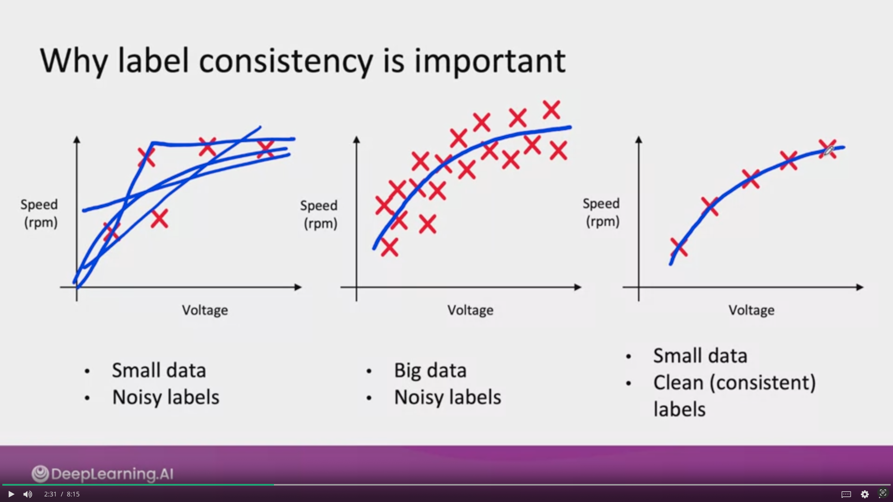
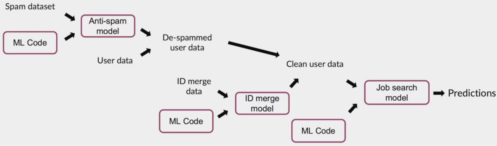

# Summary Week3 

## Define Data and Establish baseline
### Define your data right 
The data you use for your learning algorithm is the most important things for the efficency of it. For example, in computer vision, the way the bounding box is placed will be an important factor to 
### More label ambiguity examples
#### Data definition questions
* What is the input x?
    * Lighting? Contrast? Resolution?
    * What features need to be included? 
* What is the target label y?
    * How can we ensure labelers give consistent labels? 
    
### Major types of data problems

|                        | Unstructured                                               | Structured                                                                       |
|------------------------|------------------------------------------------------------|----------------------------------------------------------------------------------|
| Small data (<= 10 000) | Manufacturing visual inspection from 100 training examples | Housing price prediction based on square footage, etc. from 50 training examples |
| Big data (>10 000)     | Speech recognition from 50 million training examples       | Online shopping recommendations for 1 million users                              |

* **Unstructured** 
    * Humans can label data. 
    * Data augmentation 
* **Structured** 
    * Harder to obtain more data 
* **Small data**
    * Clean labels are critical. 
* **Big data** 
    * Emphasis on data process

#### Unstructured vs. Structured data
**Unstructured data**
* May or may not have huge collection of unlabeled examples x.
* Humans can label more data
* Data augmentation more likely to be helpful

**Structured data**
* May be more difficult to obtain more data. 
* Human labeling may not be possible (with some exceptions)

#### Small vs. Big data
**Small data (<= 10 000)** 
* Clean labels are critical 
* Can manually look through dataset and fix labels
* Can get all the labelers to talk to each other 

**Big data (> 10 000)** 
* Emphasis data process 

### Small data and label consistency

#### Big data problems can have small data challenges too 
Problems with a large dataset but where there's a long tail of rare events in the input will have small data challenges too. 
* Web search 
* Self-driving cars
* Product recommendation systems

### Improving label consistency 
* Have multiple labelers label same example
* When there is disagreement, have MLE, subject matter expert (SME) and/or labelers discuss definition of y to reach agreement.
* if labelers believe that x doesn't contain enough information consider changing x.
* Iterate unitl it is hard to significantly increase agreement 

#### Examples 
* **Standardize labels** 
"Um, nearest gas station" 
"Umm, nearest gas station"                ===> **"Um, nearest gas station"** 
"Nearest gas station [unintelligible]"
 
 * **Merge classes**
 
 Deep scratch or Shallow scratch (on iphone)  ===> **Scratch**
 
 #### Have a class/label to capture uncertainty
 * Defect: 0 or 1 
 
=> *Alternative:* 0, Borderline, 1

* Unintelligible audio 
"Nearest go"
"Neareast grocery"
"Nearest **[unintelligible]**" <- 

#### Small vs. Big data (unstructured data) for label consistency 
* **Small data**
    * Usually small number of labelers
    * Can ask labelers to discuss specific labels. 
* **Big data** 
    * Get to consistent definition with a small group 
    * Then send labeling instructions to labelers 
    * Can consider having multiple labelers label every example and using voting or consensus labels to increase accuracy 

## Human Level Performance (HLP)
### Why measure HLP? 
Estimate Bayes error / irreducible error to help with error analysis and prioritization

### Other uses of HLP 
* In academia, establish and beat a respectable benchmark to support publication. 
* Business or product owner asks for 99% accuracy. HLP helps establish a more reasonable target 
* "Prove" the ML system is superior to humans doing the job and thus the business or product owner should adopt it **(<- use with caution)**

### The problem with beating HLP as a "proof" of ML "superiority"

"Hm... nearest gas station" <- 70% of labelers
"Um, nearest gas station" <- 30% 

Two random labelers agree: 0.7**2 + 0.3 **2 = **0.58**
ML agrees with humans: 0.7

The 12% better performance is not important for anything! This can also mask more significant errors ML may be making.

### Raising HLP
When the ground truth label is externally defined (e.g. biopsy), HLP gives an estimate for Bayes error / irreducible error. 
But often ground truth is just another human label. 

 | Scratch length (mm) | Ground Truth Label | Inspector |
|:--------------------|--------------------|-----------|
| 0.7                 | 1                  | 1         |
 | 0.2                 | ~~1~~    0              | 0         |
 | 0.5                 | 1                  | 1         |
 | 0.2                 | 0                  | 0         |
 | 0.1                 | 0                  | 0         |
 | 0.1                 | 0                  | ~~1~~   0      |

**0.3 mm**: 66.7% -> 100%

* When the label Y comes from a human label, HLP << 100% may indicate ambiguous labeling instructions
* Improving label consistency will raise HLP 
* This makes it harder for ML to beat HLP. But the more consistent labels will raise ML performance, which is ultimately likely to benefit the actual application performance. 

### HLP on structured data
Structured data problems are less likely to involve human labelers, thus HLP is less frequently used

Some exceptions: 
* User id merging: Same person?
* Based on network traffic, is the computer hacked? 
* Is the transaction fraudulent?
* Spam account? Bot? 
* From GPS, what is the mode of transportation - on foot, bike, car, bus?

## Label and Organize data 
### Obtaining data 
#### How long should you spend obtaining data?

Model+Hyperparameters+ Data (**~~30days~~ 2 days**) -> Training (2 days) -> Error analysis (2days) 

* Get into this iteration loop as quickly possible.
* Instead of asking: How long it would take to obtain m examples? Ask: How much data can we obtain in k days.
* Exceptions: If you have worked on the problem before and from experience you know you need m examples

#### Inventory data
Brainstorm list of data sources (for example speech recognition)

| Source                 | Amount | Cost   | Time    |
|------------------------|--------|--------|:--------|
| Owned                  | 100h   | 0$     | 0       |
| Crowdsourced - Reading | 10000h | 10000$ | 14 days |
| Pay for labels         | 100h   | 6000$  | 7 days  |
| Purchase data          | 1000h  | 10000$ | 1 days  |

> Other factors: Data quality, privacy, regulatory constraints

#### Labeling data
* Options: In-house vs. outsourced vs. crowdsourced 
* Having MLEs label data is expensive. But doing this for just a few days is usually fine. 
* Who is qualified to label?
    * Speech recognition - any reasonably fluent speaker
    * Factory inspection, medical image diagnosis - SME(subject matter expert)
    * Recommender systems - maybe impossible to label well
* Don't increase data by more than 10x at a time

### Data pipeline
#### Example - Job search
X = user info 
Y = looking for job

**raw data** => **Data cleaning**[spam cleanup + user ID merge] => **ML** => y 

* **Development**
    * Data -> Preprocessing scripts -> ML -> Test set performance
* **Production**
    * New data -> **Replicate scripts** -> ML -> Product

How to replicate "Replicate scripts" ?

#### POC and Production phases
POC (proof-of-concept):
* Goal is to decide if the application is workable and worth deploying
* Focus on getting the prototype to work!
* it's ok if data pre-processing is manual. But take extensive notes/comments.

Production phase:
* After project utility is established, use more sophisticated tools to make sure the data pipeline is replicable 
* E.G. Tensorflow transform, Apache Beam, Airflown, ...

### Meta data, data provenance and lineage
#### Example 
Task: Predict if someone is looking for a job (x=user data, y=looking for a job?)

Keep track of **data provenance**(where it comes from) and **lineage** (sequence of steps) 

### Meta-data 
**Examples:**
* Manufacturing visual inspection: Time, factory, line #, camera settings, phone model, inspector ID, ...
* Speech recognition: Device type, labeler ID, VAD model ID,...

**Useful for:** 
* Error analysis. Spotting unexpected effects
* Keeping track of data provenance

### Balanced train/dev/test splits in small data problems
* Visual inspection exampl: 100 examples, 30 positive (defective)

Train/dev/test: 60% / 20% / 20%
Random split: 21 / 2 / 7  positive example (35% 10% 35%)

Want: 18 / 6 / 6 -> (30% / 30% / 30%) Balanced split

> No need to worry about this with **large datasets** - a random split will be representative. 