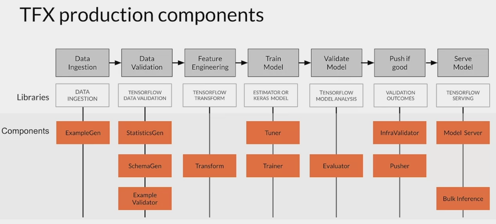

# 2nd modules - ML data lifecycle in production

# Data in production setting
### Summary  - DATA
* Differences between ML modeling and a production ML system
* Responsible data collection for building a fair production ML system
* Process feedback and human labeling
* Detecting data issues
## Collecting, Labeling, and Validating data
### The importance of data 
*"Data is the hardest part of ML and the most important piece to get right... Broken data is the most common cause of problems in production ML systems" by Uber* 

|                     | Academic/Research ML        | Production ML                         |
|---------------------|-----------------------------|---------------------------------------|
| Data                | Static                      | Dynamic                               |
| Priority for design | Highest overall accuracy    | Fast inference, good interpretability |
| Model training      | Optimal tuning and training | Continuously access and retrain       |
| Fairness            | Very important              | Crucial                               |
| Challenge           | High accuracy algorithm     | Entire system                         |

### Managing the entire life cycle of data
* Labeling
* Feature space coverage
* Minimal dimensionality
* Maximum predictive data
* Fairness
* Rare conditions

### Modern software development
Accounts for:
* Scalability
* Extensibility
* Configuration
* Consistency & reproducibility
* Safety & security 
* Modularity
* Testability 
* Monitoring
* Best practices

### Challenges
* Build integrated ML systems
* Continuously operate it in production
* Handle continuously changing data
* Optimize compute resource costs

## ML Pipelines
### Production ML infrastructure

#### Tensorflow extended production components:

## Collecting data
Data pipeline: Data collection, ingestion and preparation

#### ML: Data is a first class citizen
* Software 1.0
    * Explicit instructions to the computer
* Software 2.0
    * Specify some goal on the behavior of a program 
    * Find solution using optimization techniques
    * Good data is key for success 
    * Code in Software = Data in ML

##### Key points 
* Understand users, translate user needs into data problems
* Ensure data coverage and high predictive signal
* Source, store and monitor quality data responsibly

### Get to know your data 
* Identify data sources
* Check if they are refreshed 
* Consistency for values, units & data types
* Monitor outliers and errors

### Dataset issues
* Inconsistent formatting
    * Is zero "0", "0.0", or an indicator of a missing measurement
* Compounding errors from other ML models
* Monitor data sources for system issues and outages

### Measure data effectiveness
* Intuition about data value can be misleading
    * Which features have predictive value and which ones do not? 
* Feature engineering helps to maximize the predictive signals 
* Feature selection helps to measure the predictive signals

##### Keypoints
* Understand your user, translate their needs into data problems
    * What kind of/how much data is available
    * What are the details and issues of your data 
    * What are your predictive features
    * What are the labels you are tracking
    * What are your metrics

    
## Security, privacy & fairness
### Avoiding problematic biasis in datasets

### Data security and privacy
* Data collection and management isn't just about your model
    * Give user control of what data can be collected
    * Is there a risk of inadvertently revealing user data?
* Compliance with regulations and policies (e.g. GDPR)

### Users privacy 
* Protect personally identifiable information
    * Aggregation - replace unique values with summary value
    * Redaction - remove some data to create less complete picture

### How ML systems can fail users

#### Commit to fairness
* Make sure your models are fair 
    * Group fairness, equal accuracy
* Bias in human labeled and/or collected data 
* ML Models can amplify biases

 
   
### Biased data representation

#### Reducing bias: Design fair labeling systems
* Accurate labels are necessary for supervised learning
* Labeling can be done by:
    * Automation (logging or weak supervision)
    * Humans (aka "Raters", often semi-supervised)

##### key points
* Ensure rater pool diversity
* Investigate rater context and incentives
* Evaluate rater tools 
* Manage cost
* Determine freshness requirements

## Labeling -  Case study: Degraded model performance

### What causes problems? 
##### Kinds of problems:
* Slow - example: drift
* Fast - example: bad sensor, bad software update

#### Gradual problems 
Example: Shoes business
* **Data changes:**
    * Trend and seasonality
    * Distribution of features changes
    * Relative importance of features changes
*  **World changes:**
    *  Styles change
    *  Scope and processes change
    *  Competitors change
    *  Business expands to other geos

#### Sudden problems
* **Data collection problem:**
    * Bad sensor/camera
    * Bad log data
    * Moved or disabled sensors/cameras
* **Systems problems:**
    * Bad software update
    * Loss of network connectivity
    * System down 
    * Bad credentials

### Why "Understand" the model?
* Mispredictions do not have uniform **cost** to your business
* The **data you have** is rarely the data you wish you had 
* Model objective is nearly always a **proxy** for your business objectives
* Some percentage of your customers may have **a bad experience**

### Data and concept change in ML prod
#### Detecting problems with deployed models
* Data and scope changes
* Monitor models and validate data to find problems early 
* Changing ground truth: label new training data

#### Easy problems 
* Ground truth changes slowly (months, years)
* Model retraining driven by:
    * Model improvements, better data
    * Changes in software and/or systems
* Labeling
    * Curated datasets
    * Crowd-based

#### Harder problems
* Ground truth changes faster (weeks)
* Model retraining driven by:
    * Declining model performance
    * Model improvements better data
    * Changes in software and/or system
* Labeling 
    * Direct feedback
    * Crowd-based

#### Really hard problems
* Ground truth changes very fast (days, hours, min)
* Model retraining driven by:
    * Declining model performance
    * Model improvements, better data
    * Changes in software and/or system
* Labeling
    * Direct feedback
    * Weak supervision

##### Key points
* Model performance decays over time
    * Data and Concept drift
* Model retraining helps to improve perfomance
    * Data labeling for changing ground truth and scarce labels

### Data labeling 
Variety of Methods
* **Process feedback (Direct labeling)** *<- most common*
    * Example: Actual vs. predicted click-through
* **Human labeling** *<- most common*
    * Example: Cardiologists labeling MRI images
* Semi-supervised Labeling
* Active learning
* Weak supervision

#### Direct labeling: continuous creation of training dataset

> Process feedback - Advantages:
> * Training dataset continuous creation
> * Labels evolve quickly
> * Captures strong labels signals
> 
> Process feedback - Disadvantages:
> * Hindered by inherent nature of the problem
> * Failure to capture ground truth 
> * Largely bespoke design

#### Process feedback - Open-source log analysis tools
**Logstash** 
Free and open source data processing pipeline
* Ingests data from a multitude of sources
* Transforms it 
* Sends it to your favorite "stash."

**Fluentd**
Open source data collector
Unify the data collection

#### Process feedback - Cloud log analytics
**Google Cloud Logging**
* Data and events from Google Cloud and AWS
* BindPlane. Logging:application component, on-premise and hybrid cloud systems
* Sends it to your favorite "stash"

**AWS Elastic Search**

**Azure Monitor**

### Human labeling

> Human labeling - advantages
> * More labels 
> * Pure supervised learning
> 
> Human labeling - disadvantages:
> * Quality consistency: Many datasets difficult for human labeling
> * Slow
> * Expensive
> * Small dataset curation

#### why is human labeling a problem? 

 

##### Key points
* Various methods of data labeling
    * Process feedback
    * Human labeling
* Advantages and disadvantages of both 

## Validating Data  
### Drift and skew
**Drift**
Changes in data over time, such as data collected once a day

**Skew**
Difference between two static versions, or different sources, such as training set and serving set

#### Model decay: data drift

#### Performance decay: Concept drift

### Detecting data issues
* Detecting schema skew
    * Training and serving data do not conform to the same schema
* Detecting distribution skew
    * Dataset shift -> covariate or concept shift
* Requires continuous evaluation

#### Detecting distribution skew

#### Skew detection workflow

### Tensorflow data validation
#### TFDV
* Understand, validata and monitor ML data at scale
* Used to analyse and validate petabytes of data at Google every data
* Proven track record in helping TFX users maintain the health of their ML pipelines

#### TFDV capabilities
* Generates data statistics and browser visualizations
* Infers the data schema
* Performs validity checks against schema 
* Detects training/serving skew

#### TFDV detects 3 types of skew 
1. ##### Schema skew 
    * Serving and training data don't conform to same schema
        * For example: int != float
2. ##### Feature skew
    * Training feature values are different than the serving feature values:
        * Feature values are modified between training and serving time
        * Transformation applied only in one of the two instances
3. ##### Distribution skew
    * Distribution of serving and training dataset is significantly different:
        * Faulty sampling method during training
        * Different data sources for training and serving data
        * Trend, seasonality, changes in data over time

##### Key points
* TFDV: Descriptive statistics at scale with the embedded facets visualizations
* It provides insight into:
    * What are the underlying statistics of your data
    * How does your training, evaluation, and serving dataset statistics compare
    * How can you detect and fix data anomalies

