# 2nd modules - ML data lifecycle in production

# Introduction to preprocessing
## Feature Engineering

### Squeezing the most out of data 
* Making data useful before training a model
* Representing data in forms that help models learn 
* Increasing predictive quality
* Reducing dimensionality with feature engineering

### Art of feature engineering

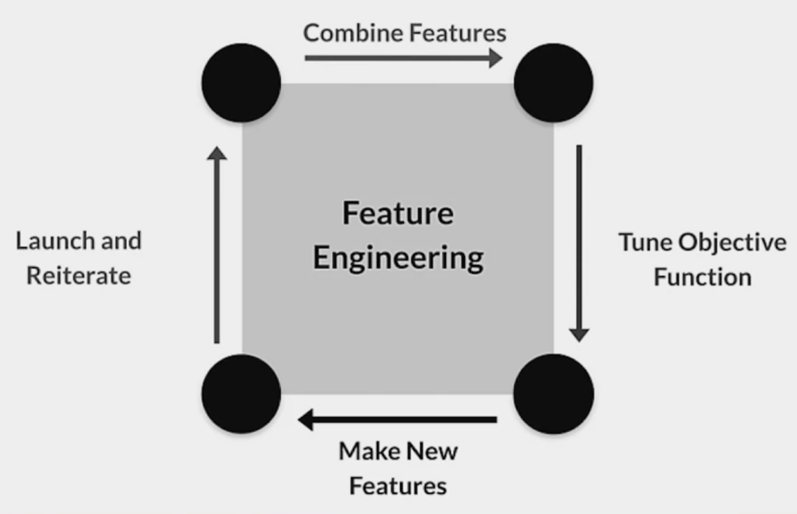

##### key points
* Feature engineering can be difficult and time consuming, but also very important to success
* Squeezing the most out of data through feature engineering enables models to learn better
* Concentrating predictive information in fewer features enables more efficient use of compute resources

### Main preprocessing operations

### Mapping raw data into features

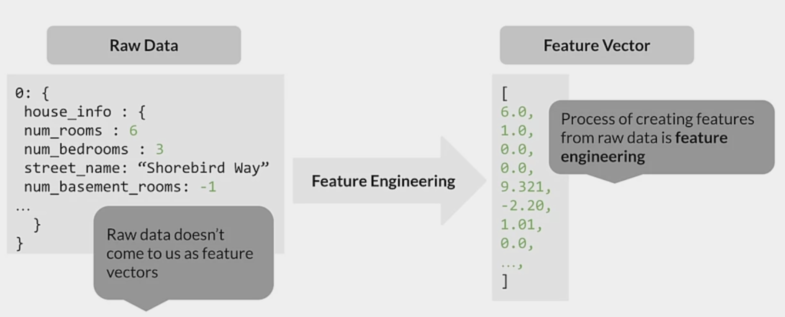
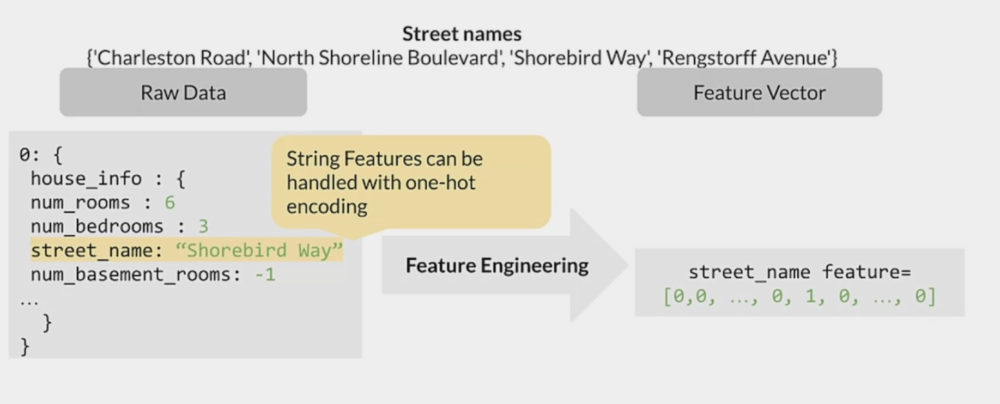
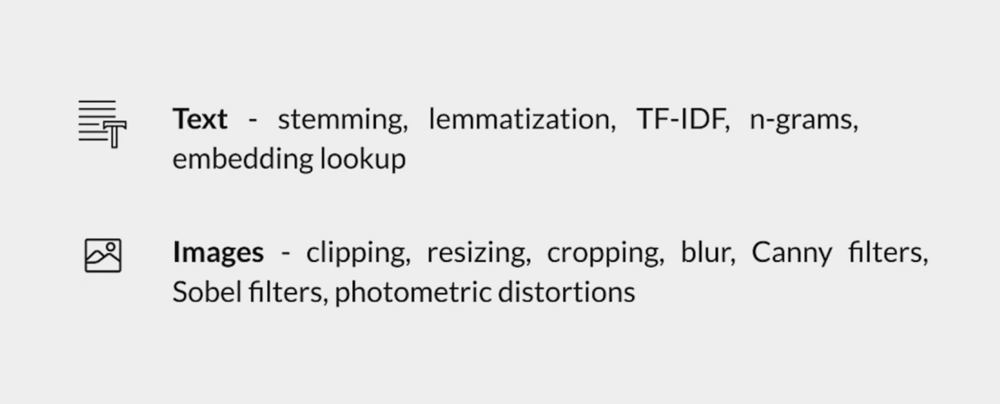

##### key points
* Data preprocessing: transforms raw data into a clean and training-ready dataset
* Feature engineering maps:
    * Raw data into feature vectors
    * Integer values to floating-point values
    * Normalizes numerical values
    * Strings and categorical values to vectors of numeric values
    * Data from one space into a different space

## Feature engineering 
* **Numerical Range**
    * Scaling 
    * Normalizing 
    * Standardizing
* **Grouping**
    * Bucketizing
    * Bag of words

    
#### Scaling 
* Converts values from their natural range into a prescribed range 
    * e.g. Grayscale image pixel intensity scale is [0, 255] usually rescaled to [-1, 1]

> Benefits
> * Helps neural nets converge faster 
> * Do away with NaN errors during training
> * For each feature, the model learns the right weights    

#### Normalization

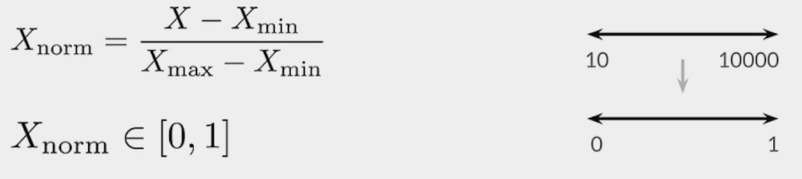
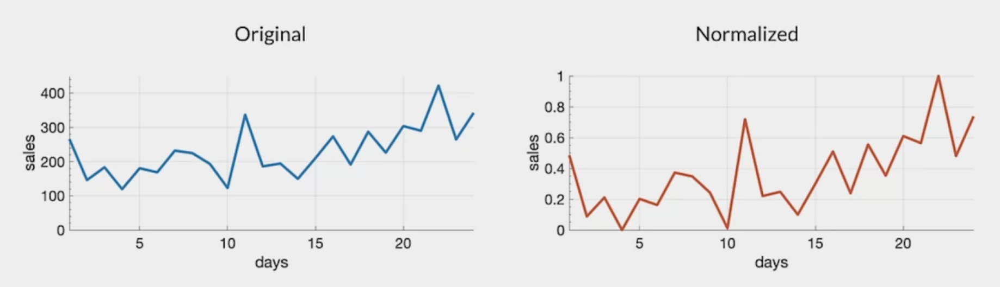

#### Standardization (z-score)
* Z-score relates the number of standard deviations away from the mean 
* Example: 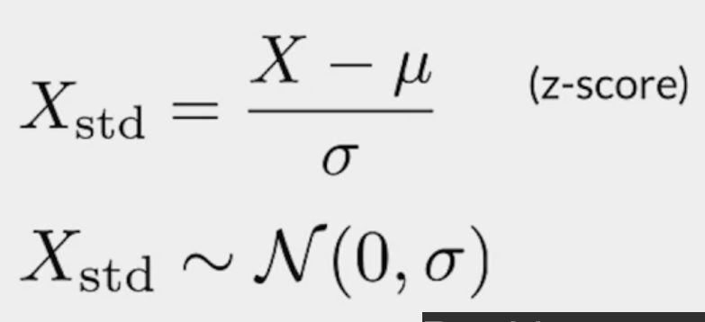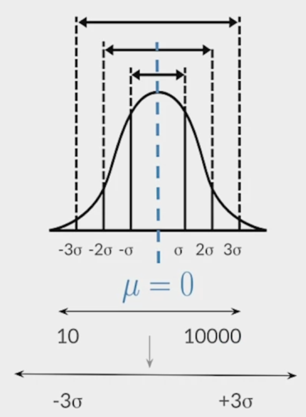
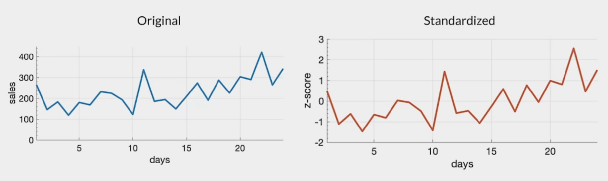

> Data is centered in 0

#### Bucketizing / Binning 

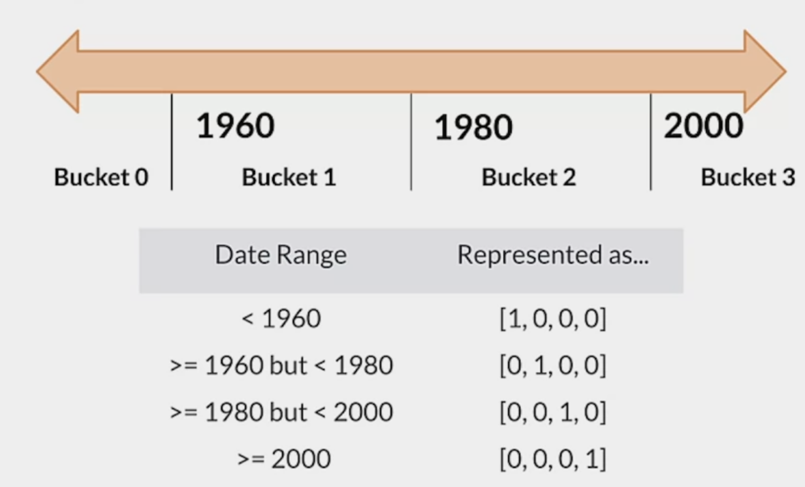

#### Other techniques
* Dimensionality reduction in embeddings 
    * Principal component analysis (PCA)
    * t-Distributed stochastic neighbor embedding (t-SNE)
    * Uniform manifold approximation and projection (UMAP)
* Feature crossing 

#### Tensorflow embedding projector

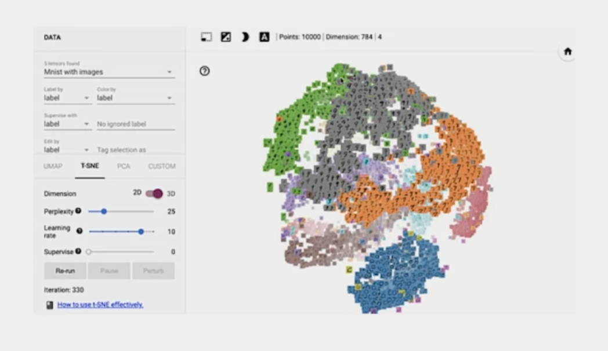

* Intuitive exploration of high-dimensional data
* Visualize & analyze
* Techniques
    * PCA
    * t-SNE
    * UMAP
    * Custom linear projection

##### key points
* Feature engineering: 
    * Prepares, tunes, transforms, extracts and constructs features
* Feature engineering is key for model refinement 
* Feature engineering helps with ML analysis

## Feature crosses

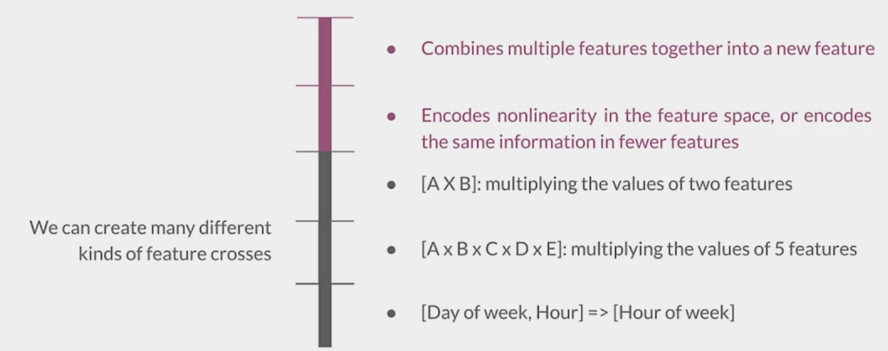

#### key points
* Feature crossing: synthetic feature encoding nonlinearity in feature space.
* Feature coding: transforming categorical to a continuous variable.

# Preprocessing data at scale

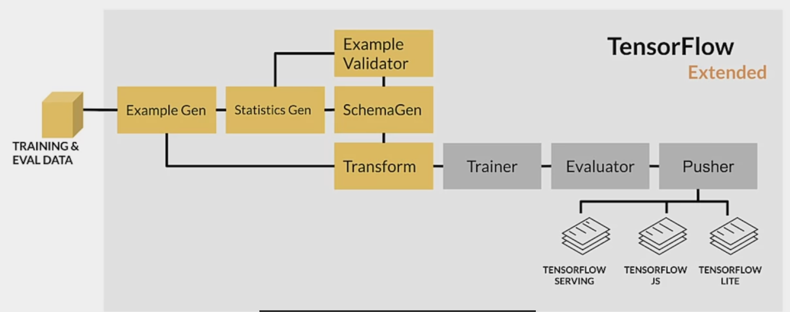
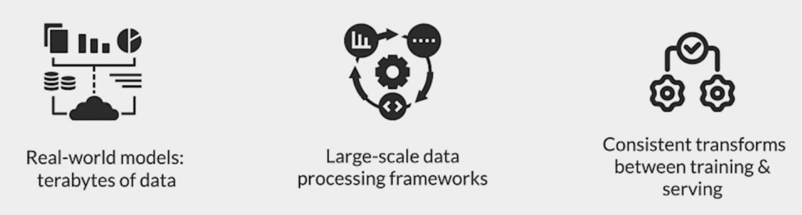

### Inconsistencies in feature engineering

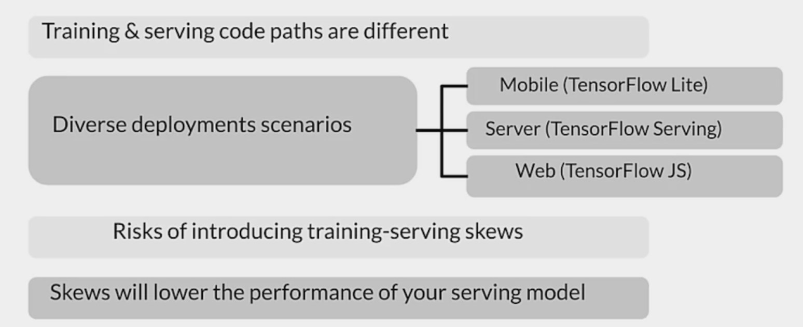

### Preprocessing granularity 
##### Transformations

| Instance-level     | Full-pass        |
|:-------------------|------------------|
| Clipping           | Minimax          |
| Multipliying       | Standard scaling |
| Expanding features | Bucketizing      |
| etc.               | etc.             |

#### When do you transform? 
Pre-processing training dataset

| Pros                      | Cons                                  |
|---------------------------|---------------------------------------|
| Run-once                  | Transformations reproduced at serving |
| Compute on entire dataset | Slower iterations                     |

#### How about 'within' a model?
Transforming within the model 

| Pros                      | Cons                            |
|---------------------------|---------------------------------|
| Easy iterations           | Expensive transforms            |
| Transformation guarantees | Long model latency              |
|                           | Transformations per batch: skew |

#### Why transform per batch?
* For example, normalizing features by their average
* Access to a single batch of data, not the full dataset
* Ways to normalize per batch
    * Normalize by average within a batch 
    * Precompute average and reuse it during normalization

### Optimizing instance-level transformations
* Indirectly affect training efficiency 
* Typically acceleratores sit idle while the CPUs transform 
* Solution:
    * Prefetching transforms for better accelerator efficiency

### Summarizing the challenges 
* Balancing predictive performance 
* Full-pass transformations on training data
* Optimizing instance-level transformations for better training efficiency (GPUs, TPUs, ...)

##### key points
* Inconsistent data affects the accuracy of the results
* Need for scaled data processing frameworks to process large datasets in an efficient and distributed manner

## Tensorflow transform

### tf.transform

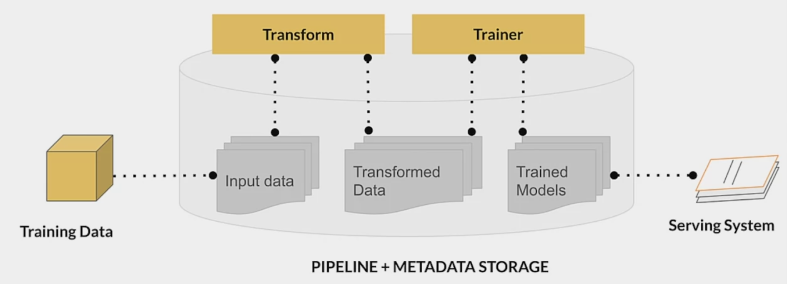

### Inside TensorFlow Extended

### tf.transform layout

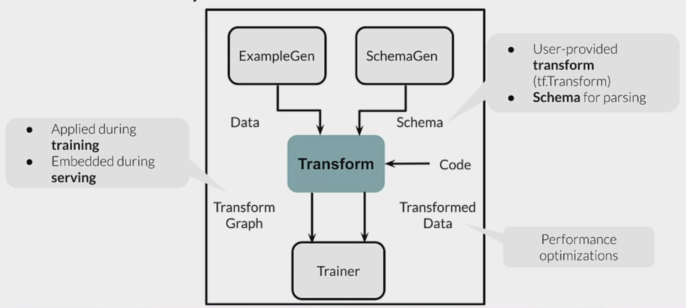

### tf.transform : going deeper
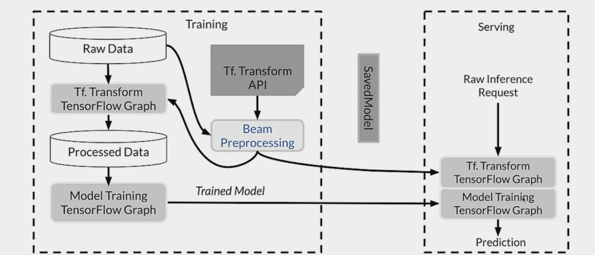

### tf.Transform Analyzers

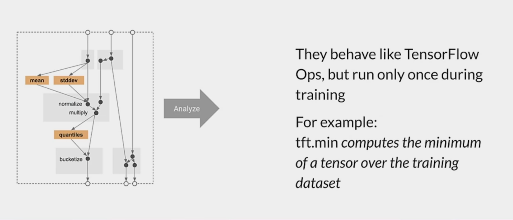

#### How transform applies feature transformations

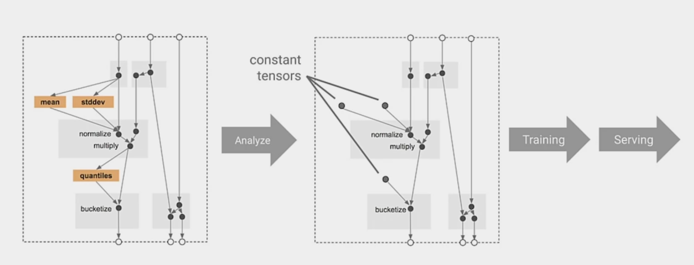

## benefits of using tf.Transform
* Emitted tf.Graph holds all necessary constants and transformations
* Focus on data preprocessing only at training time
* Works in-line during both training and serving
* No need for preprocessing code at serving time
* Consistently applied transformations irrespective of deployment platform

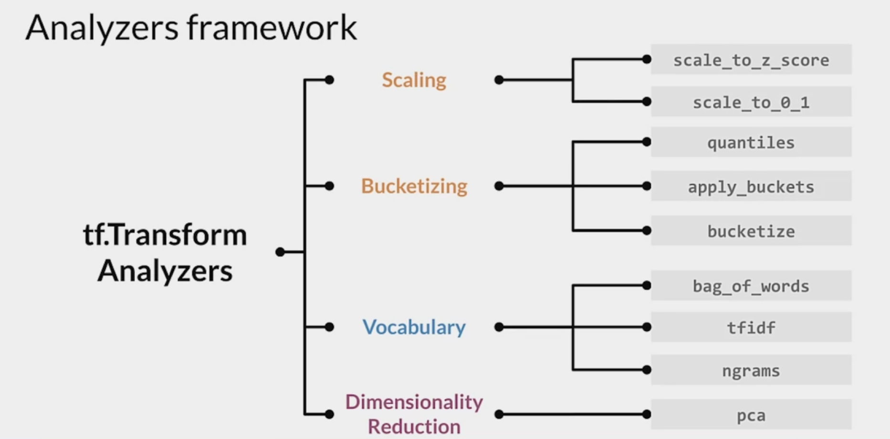

##### key points 
* tf.Transform allows the pre-processing of input data and creating features
* tf.Transform allows defining pre-processing pipelines and their execution using large-scale data processing frameworks
* In a TX pipeline, the Transform component implements feature engineering using TensorFlow Transform

***
## Feature Selection
### Feature Spaces
* N dimensional space defined by your N features
* Not including the target label 

#### Feature space coverage
* Train/eval datasets representative of the serving dataset 
    * Same numerical ranges
    * Same classes
    * Similar characteristics for image data
    * Similar vocabulary, syntax and semantics for NLP data

#### Ensure feature space coverage
* Data affected by: seasonality, trend, drift
* Serving data: new values in features and labels
* Continuous monitoring: key for success !

### Feature selection

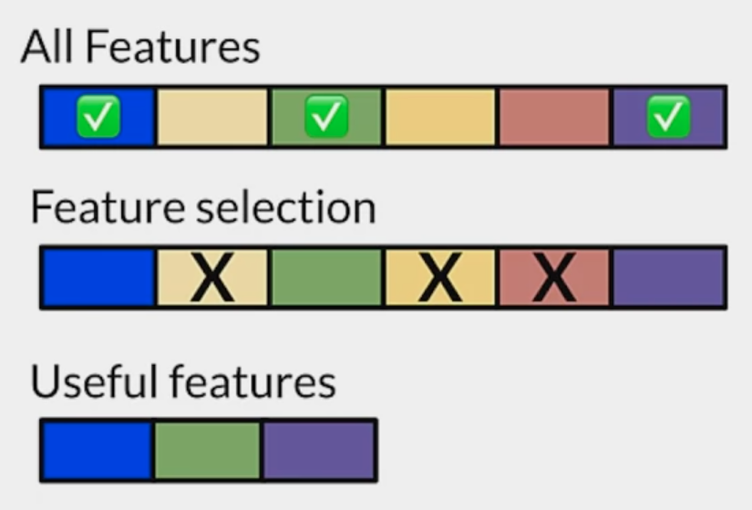

* Identify features that best represent the relationship
* Remove features that don't influence the outcome
* Reduce the size of the feature space 
* Reduce the resource requirements and model complexity

#### why is feature selection needed?

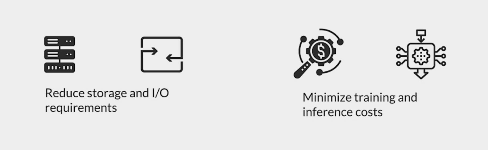

### Feature selection methods 
#### Unsupervised
* Features-target variable relationship not considered
* Removes redundant features (correlation)

#### Supervised
* Uses features-target variable relationship
* Selects those contributing the most 

##### Supervised methods
* Filter methods
* Wrapper methods
* Embedded methods

### 1.Filter methods 
* #### Correlation
    * Correlated features are usually redundant 
        * Remove them!
    * ***Pearson Correlation*** (Linear relationships)
        * Between features, and between the features and the label. 
    * ***Kendall Tau Rank Correlation Coefficient*** (Monotonic relationships & small sample size)
    * ***Spearman's Rank Correlation Coefficient*** (Monotonic relationships)

> Other methods: Mutual information, F-Test, Chi-Squared test

Correlation matrix: 
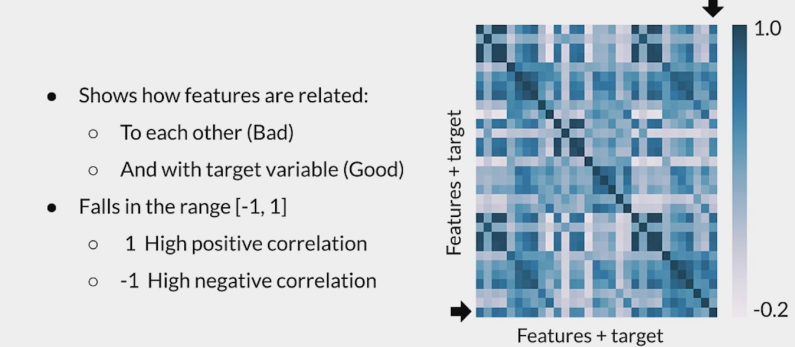

* #### Univariate feature selection
    * SelectKBest
    * SelectPercentile
    * GenericUnivariateSelect

Statistical tests available: 
* Regression: f_regression, mutual_info_regression
* Classification: chi2, f_classif, mutual_info_classif

#### Comparison - Filter methods 
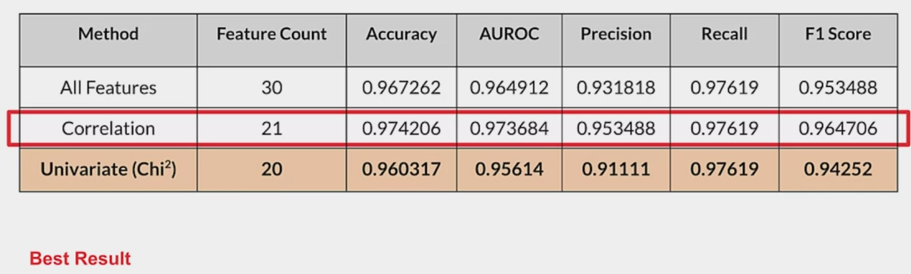

### 2.Wrapper methods

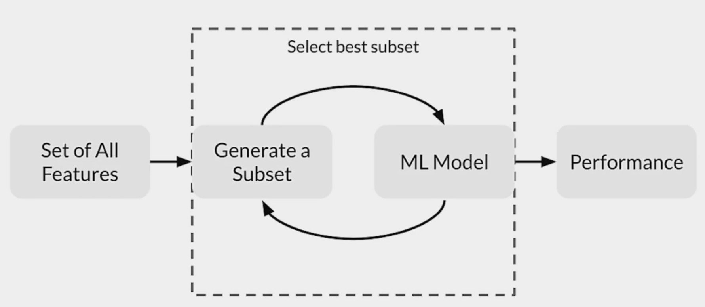

Popular wrapper methods:
1. **Forward Selection**
    1. Iterative, greedy method
    2. Starts with 1 feature
    3. Evaluate model perfomrmance when adding each of the additional features one at a time
    4. Add next feature that gives the best performance
    5. Repeat unitl there is no improvement
2. **Backward Selection**
    1. Start with all features
    2. Evaluate model perf when removing each of the included features , one at a time
    3. Remove next feature that fives the worst performance
    4. Repeat until there is no improvement 
3. **Recursive Feature Elimination (RFE)**
    1. Select a model to use for evaluating feature importance
    2. Select the desire number of features
    3. Fit the model 
    4. Rank features by importance
    5. Discard least important features 
    6. Repeate until the desired number of features remains 

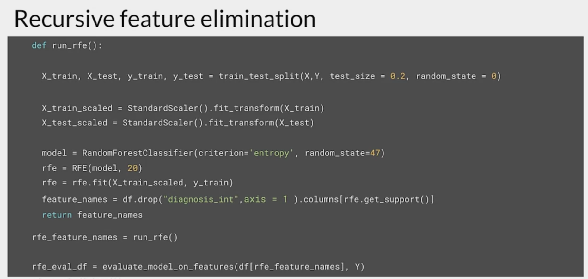

#### Performance table 

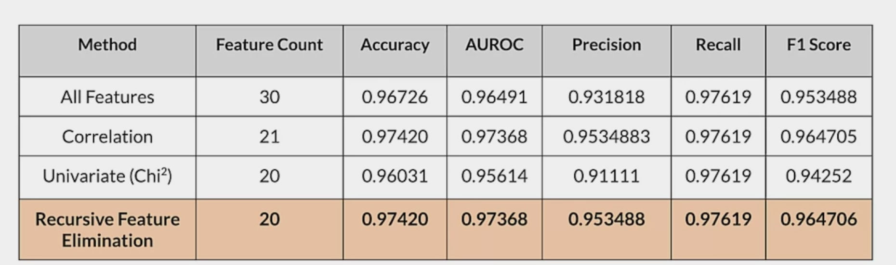

### Embedded methods

1. **Feature importance**
    * Assigns scores for each feature in data
    * Discard features scored lower by feature importance
    * Feature importance class is in-built in Tree Based Models (e.g., RandomForestClassifier)
    * Feature importance is available as a property feature_importances
    * We can then use SelectFromModel to select features from the trained model based on assigned feature importances

    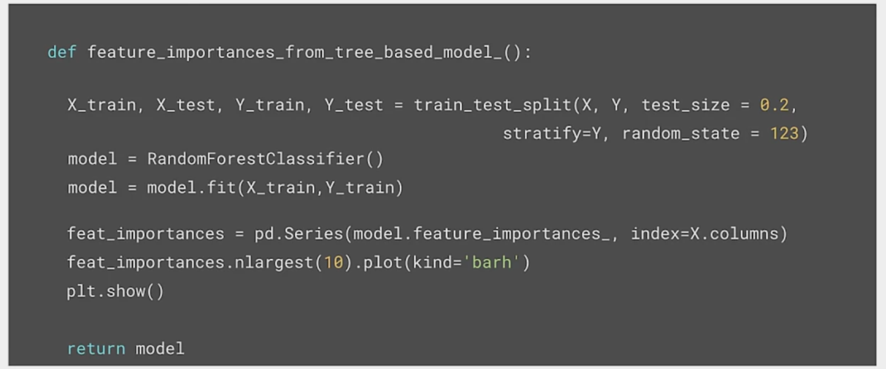

#### Performance table

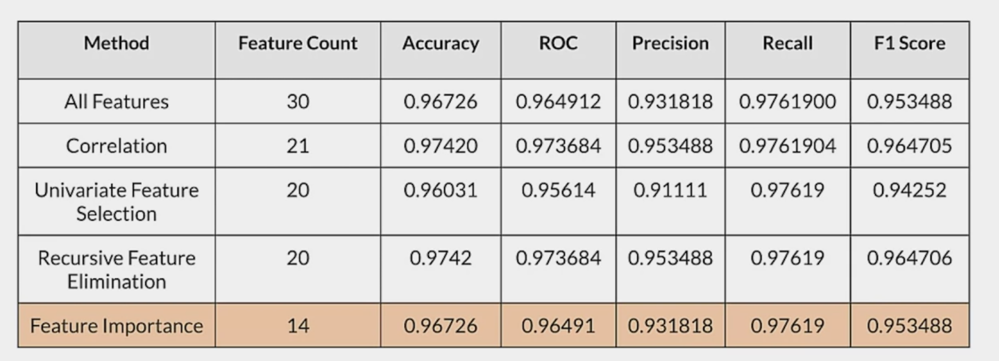
