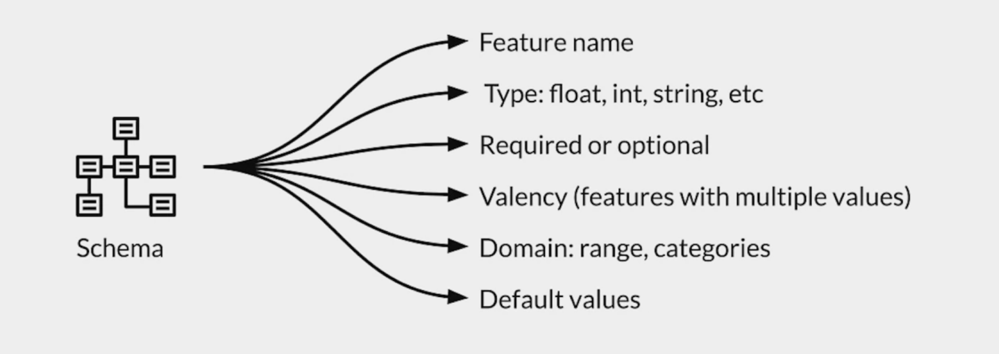

# Week 3 - Data journey 

## ML Metadata storage backend 
* ML metadata registers metadata in a database called Metadata Store
* APIs to record and retrieve metadata to and from the storage backend:
    * Fake database: in-memory for fast experimentation/prototyping
    * SQLite: in-memory and disk
    * MySQL: server based
    * Block storage: File system, storage area network, or cloud based

    
##### key points 
* Walk through over the data journey addressing lineage and provenance
* The importance of metadata for tracking data evolution
* ML Metadata library and its usefulness to track data changes
* Running an example to register artifacts, executions, and contexts

## Schema development

### Inspect anomalies in serving dataset

##### key points
* Iteratively update and fine-tune schema to adapt to evolving data
* How to deal with scalability and anomalies
* Set schema environments to detect anomalies in serving requests

## Feature stores
is a central repository
* Avoid duplication
* Control access
* Purge

### Key aspects 
* Managing feature data from a single person to large enterprises.
* Scalable and performant access to feature data in training and serving.
* Provide consistent and point-in-time correct access to feature data.
* Enable discovery, documentation and insights into your features

## Data warehouse

### Advantages of data warehouse
* Enhanced ability to analyze data
* Timely access to data
* Enhanced data quality and consistency 
* High return on investment 
* Increased query and system performance 

### Comparison with databeses 

| Data warehouse                         | Database                                  |
|----------------------------------------|-------------------------------------------|
| Online analytical processing (OLAP)    | Online transactional processing (OLTP)    |
| Data is refreshed from source systems  | Data is available real-time               |
| Stores historical and current data     | Stores only current data                  |
| Data size can scale to >= terabytes    | Data size can scale to gigabytes          |
| Queries are complex, used for analysis | Queries are simple, used for transactions |
| Queries are long running jobs          | Queries executed almost in real-time      |
| Tables need not be normalized          | Tables normalized for efficiency          |

## Data lakes

### Comparison with data warehouse

|                  | Data warehouses                             | Data lakes                            |
|------------------|---------------------------------------------|---------------------------------------|
| Data structure   | Processed                                   | Raw                                   |
| Purpose of data  | Currently in use                            | Not yet determined                    |
| Users            | Business professionals                      | Data scientists                       |
| Accessibility    | More complicated and costly to make changes | Highly accessible and quick to update |

##### Key points
* **Feature store:** central repository for storing documented, curated, and access-controlled features, specifically for ML.
* **Data warehouse:** subject-oriented repository of structured data optimized for fast read.
* **Data lakes:** repository of data stored in its natural and raw format.
