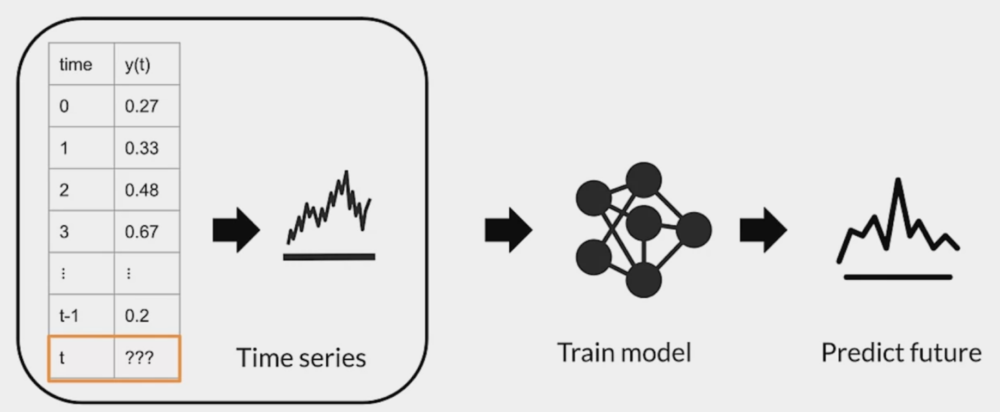

# Semi-supervised learning 
## Advanced labeling

### Why is Advanced Labeling important? 
 
 
 
 ### Active learning 
 
 

### Intelligent sampling - Margin sampling

* **Margin sampling**: Label points the current model is least confident in 
* **Cluster-based sampling**: sample from well-formed clusters to "cover" the entire space.
* **Query-by-committee:** train an ensemble of models and sample points that generate disagreement 
* **Region-based sampling**: Runs several active learning algorithm in different partitions of the space 

## Weak supervision
#### Hand labeling: intensive labor
*"Hand-labeling training data for machine learning problems is effective, but very labor and time intensive. This work explores how to use algorithmic labeling systems relying on other sources of knowledge that can provide many more labels but which are noisy."* Jeff Dean - 2019

*"Weak supervision is about leveraging higher-level and/or noisier input from subject matter experts (SMEs)."*

* Unlabeled data, without ground-truth labels
* One or more weak supervision sources
    * A list of heuristics that can automate labeling
    * Typically provided by subject matter experts 
* Noisy labels have a certain probability of being correct, not 100% 
* Objective: learn a generative model to determine weights for weak supervision sources 

### Snorkel 
* Programmatically building and managing training datasets without manual labeling
* Automatically: models, cleans, and integrates the resulting training data
* Applies novel, theoretically-grounded techniques
* Also offers data augmentation and slicing

#### key points 
* **Semi-supervised learning:**
    * Applies the best of supervised and unsupervised approaches
    * Using a small amount of labeled data boosts model accuracy
* **Active learning:**
    * Selects the most important examples to label
    * Improves predictive accuracy
* **Weak supervision:**
    * Uses heuristics to apply noisy labels to unlabeled examples
    * Snorkel is handy framework for weak supervision

## Data augmentation
### How do you get more data?
* Augmentation as a way to expand datasets
* One way is introducing minor alterations
* For images: flips, rotation etc.

### How does augmentation data help? 
* Adds examples that are similar to real examples
* Improves coverage of feature space
* Beware of invalid augmentations

### An example: CIFAR-10 dataset
* 60,000 32x32 color images
* 10 classes of objects (6,000 images / class) 

### Other Advanced techniques
* Semi-supervised data augmentation e.g., UDA, semi-supervised learning with GANs
* Policy-based data augmentation e.g., AutoAugment

##### key points
* It generates artificial data by creating new examples which are variants of the original data
* It increases the diversity and number of examples in the training data
* Provides means to improves accuracy, generalization, and avoiding overfitting

## Time series
### A note on different types of data

* TX pre-processing capabilities for multiple data types:
    * Images
    * Video
    * Text
    * Audio
    * Time series
* Optional notebook on images
* Two optional notebooks on time series

*"It is difficult to make predictions, especially about the future."* - Karl Kristian Steincke

#### Time series forecasting
* Time Series forecasting predicts future events by analyzing data from the past
* Time series forecasting makes predictions on data indexed by time
* Example:
    * Predict future temperature at a given location based on historical meteorological data

### Sensors and Signals 

* Signals are sequences of data collected from real time sensors
* Each data point is indexed by a timestamp
* Sensors and signals data is thus time series data
* Example: classify sequences of accelerometer data recorded by the sensors on smartphones to identify the associate activity

#### Human activity recognition (HAR)
* HAR tasks require segmentation operations
    * Raw intertial data from wearables fluctuate greatly over time

