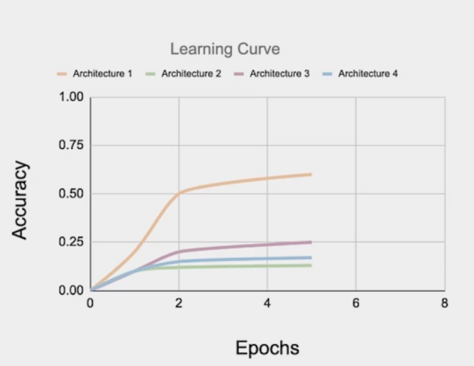

## Hyperparameters tuning - Keras tuner 

### NAS - Neural Architecture Search
* NAS is a technique for automating the design of artificial neural networks
* It helps finding the optimal architecture
* This is a search over a huge space 
* AutoML is an algorithm to automate this search

### Types of parameters in ML Models 
* Trainable parameters:
    * Learned by the algorithm during training 
    * e.g. weights of a neural network 
* Hyperparameters:
    * Set before launching the learning process 
    * not updated in each training step 
    * e.g.: learning rate or the number of units in a dense layer 

### Manual hyperparameter tuning is not scalable
* Hyperparameters can be numerous even for small models 
* e.g. shallow DNN:
    * Architecture choices 
    * activation functions 
    * Weight initialization strategy 
    * Optimization hyperparameters such as learning rate, stop condition
* Tuning them manually can be a real brain teaser 
* Tuning helps with model performance 

### Automating hyperparameters tuning with Keras Tuner 
* Automation is key: open source ressources to the rescue 
* Keras Tuner:
    * Hyperparameter tuning with tensorflow2.0
    * Many methods available

## Is the architecture optimal? 
* Do the model need more or less hidden units to perform well?
* How does model size affect the convergence speed? 
* Is there any trade of between convergence speed, model size and accuracy?
* Search automation is the natural path to take 
* Keras tuner built in search functionality

# AutoML - Automated Machine Learning 

## Neural Architecture Search

* **AutoML** automates the development of ML models 
* **AutoML** is not specific to a particular type of model
* Neural Architecture Search (**NAS**) is a subfield of AutoML
* NAS is a technique for automating the desing of Artificial neural networks (ANN) 

### Real-world use: Meredith Digital

### Understanding search spaces 
Two Types of search spaces:

* #### Macro Architecture search space

* #### Micro Architecture Search Space 

### Search Strategies 

**A few Search Strategies:**
1. **Grid Search**
    * Exhaustive search approach on fixed grid values
    * Suited for smaller search spaces
    * Quickly fail with growing size of search
2. **Random Search**
    * Suited for smaller search spaces
    * Quickly fail with growing size of search
3. **Bayesian Optimisation**
    * Assumes that a *specific probability distribution* is underlying the performance
    * Tested architectures constrain the probability distribution and guide the selection of the next option
    * In this way, promising architectures can be stochastically determined and tested 
4. **Evolutionary algorithms** 
    * 
5. **Reinforcement Learning** 
    * Agents goal is to maximize a reward
    * The available options are selected from the search space
    * The performance estimation strategy determines the reward
    * 

5.5 **Reinforcement Learning for NAS**
* 
## Measuring AutoML efficacy 
### Performance Estimation Strategy 

#### Strategy to reduce the cost
* **Lower fidelity estimates**
    * Reduce training time
        * *Data subset*
        * *Low resolution images*        
        * *Fewer filters and cells*    
    * Reduce cost but understimates performance
    * Works if relative ranking of architectures does not change due to lower fidelity estimates
    * Recent research show this is not the case
* **Learning curves extrapolation**
    * Requires predicting the learning curbe reliably 
    * Extrapolates bnased on initial learning
    * Removes poor performers
    * 
* **Weight inheritance/Network Morphisms**
    * Initialize weights of new architectures based on perviously trained architectures
        * Similar to transfer learning
    * Uses **Network Morphism** 
    * Underlying function unchanged 
        * New network inherits knowledge from parent network
        * Computationoal speed up: only a few days of GPU usage 
        * Network size not inherently bounded

## AutoML on cloud 
* **Amazon SageMaker Autopilot**
    * 
    * Key features:
        * 
    * Typical use cases:
        * 
* **Azure Automated ML** 
    * 
    * Key features
        * 
* **Google Cloud AutoML** 
    * 

