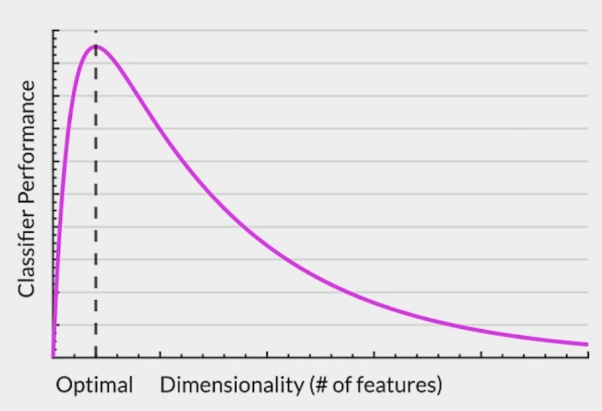
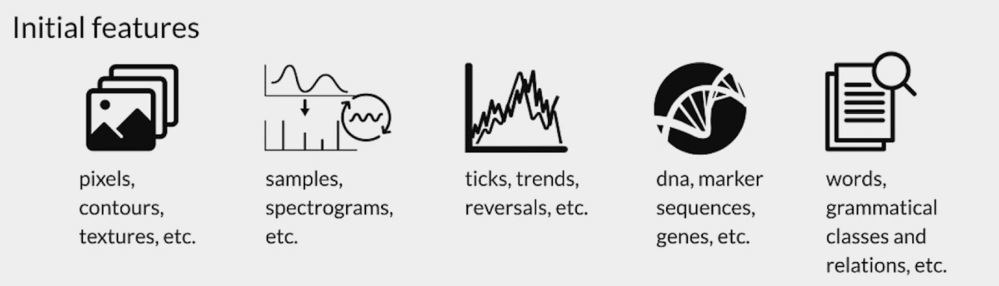
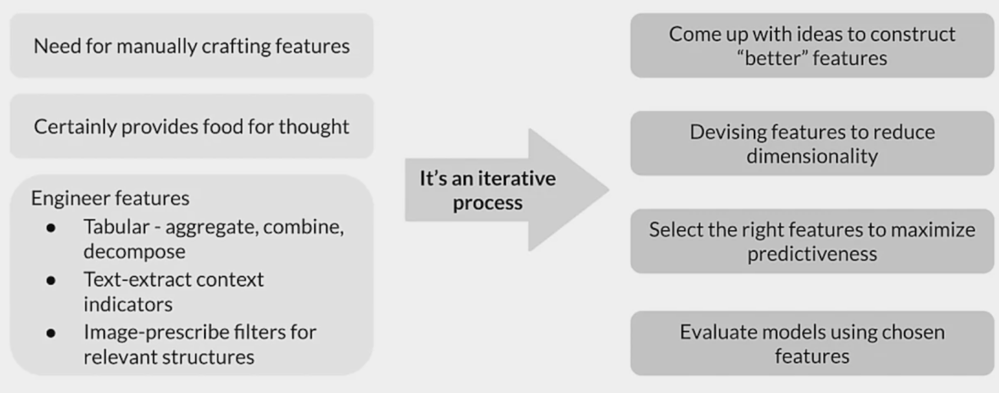
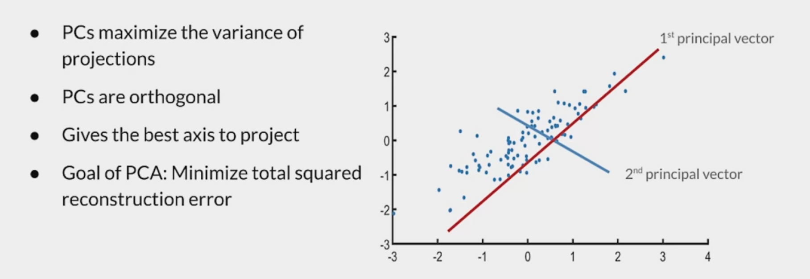
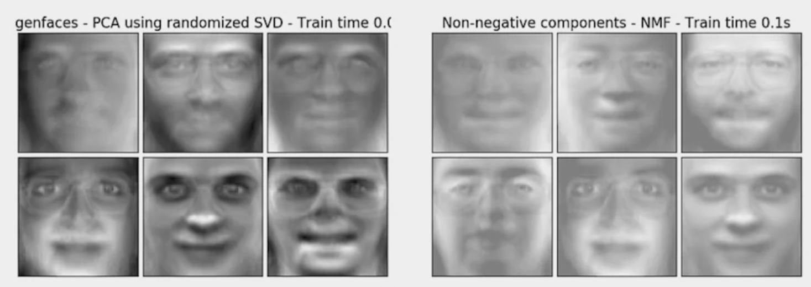
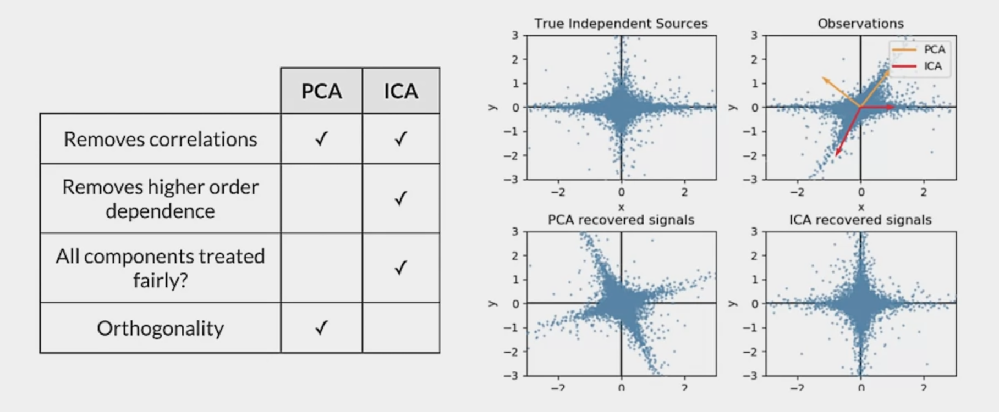
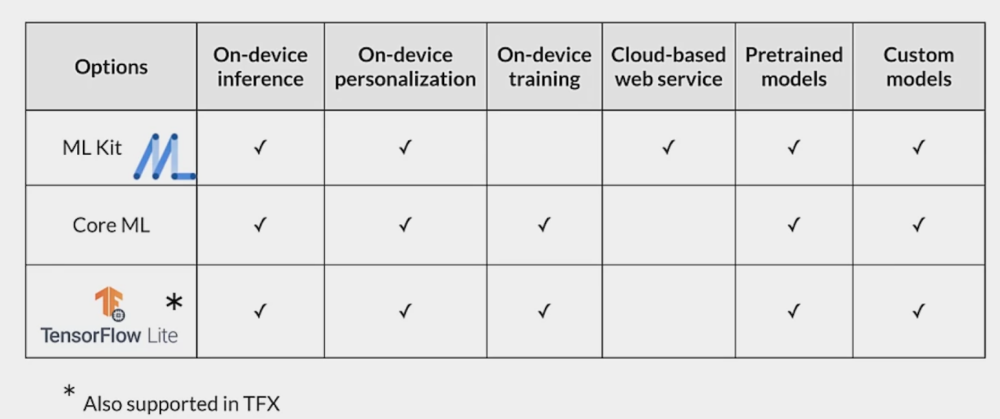
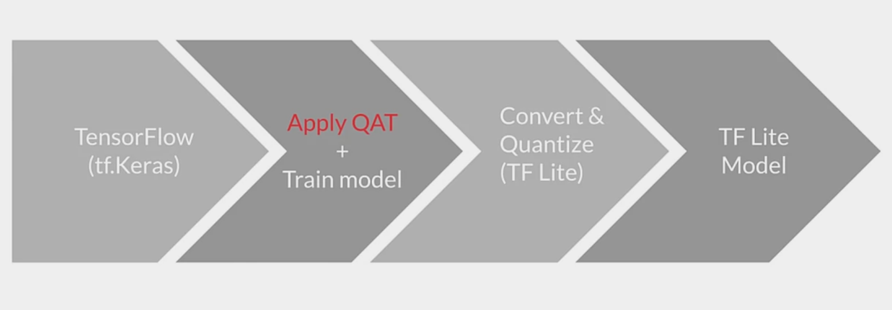
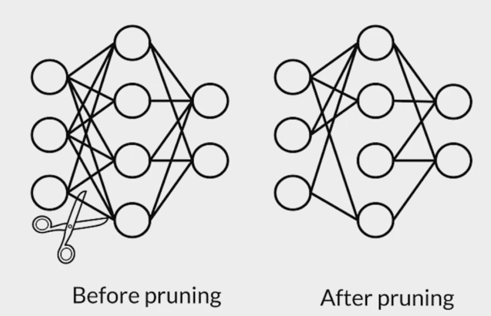

# Week 2 - Model Resource Management Techniques

## Dimensionality Reduction
### High-dimensional data 

Now... data science is about integrating everything 
* Data generation and storage is less of a problem
* Squeeze out the best from data
* More high-dimensional data having more features 

> A note about neural networks:
> * Yes, neural networks will perform a kind of automatic feature selection
> * However, that's not as efficient as a well-designed dataset and model 
>   * Much of the model can be largely "shut off" to ignore unwanted features 
>   * Even unused parts of the consume space and compute resources 
>   * Unwanted features can still introduce unwanted noise 
>   * Each feature requires infrastructure to collect, store and manage 

 ### Why is high-dimensional data a problem? 
 * more dimensions -> more features
 * Risk of overfitting our models 
 * Distances grow more and more alike
 * No clear distinction between clustered objects 
 * Concentration phenomenon for euclidien distance

##### Curse of dimensionality
 *"As we add more dimensions we also increase the processing power we need to train the model and make predictions, as well as the amount of training data required"* - Badreesh Shetty
 
 ### Why are more features bad? 
 * Redundant / irrelevant features
 * More noise added than signal
 * Hard to interpret and visualize
 * Hard to store and process data

 

### Curse dimensional - example 
#### How dimensionality impacts in other ways 
* Runtime and system memory requirements
* Solutions take longer to reach global optima 
* More dimensios raise the likelihood of correlated features 

#### More features require more training data 
* More features aren't better if they don't add predictive information
* Nb of training instances needed increases exponentially with each added feature
* Reduces real-worl usefulness of models 

#### What do models need?
* No hard and fast rule on how many features are required
* Number of features to be used vary depending on 
* Prefer uncorrelated data containing information to produce correct results

### Manual dimensionality-reduction
#### Increasing predictive performance 
* Features must have information to produce correct results
* Derive features from inherent features
* Extract and recombine to create new features

#### Feature explosion

#### Feature Engineering

### Principal Component Analysis (PCA)

##### Strength & Weaknesses
Strenghts:
* A versatile technique
* Fast and simple
* Offers several variations and extensions (e.g., kernel/sparce PCA)

Weaknesses:
* Result is not interpretable
* Requires setting threshold for cumulative explained variance 

### More dimensionality reduction algorithms
* **Unsupervised**
    * *Latent Semantic Indexing/Analysis (LSI and LSA) (SVD)*
        * Decomposes non-square matrices
        * Useful for sparse matrices as produced by TF-IDF
    * *Independent Component Analysis (ICA)*
        * PCA seeks directions in feature space that minimize reconstruction error
        * ICA seeks directions that are most statistically independent
        * ICA addresses higher order dependence
* **Matrix Factorization**
    * *Non-Negative Matrix Factorization (NMF)*
        * NMF models are interpretable and easier to understand 
        * NMF requires the sample features to be non-negative
        * 

* **Latent Methods**
    * *Latent Dirichlet Allocation (LDA)*

    

## Quantization & Pruning 

### Mobile, IoT and Similar use cases
#### Online ML inference
* To generate real-time predictions you can:
    * Host the model on a server
    * Embed the model in the device
* Is it faster on a server, or on-device?
* Mobile processing limitations? 

#### Mobile inference
Inference on the cloud/server
* **Pros**
    * Lots of compute capacity
    * Scalable hardware
    * Model complexity handled by the server 
    * Easy to add new features and update the model
    * Low latency and batch prediction
* **Cons**
    * Timely inference is needed

On-device Inference
* **Pros**
    * Improved speed 
    * Performance 
    * Network connectivity
    * No to-and-fro communication needed
* **Cons**
    * Less capacity
    * Tight resource constraints 

### Benefits and process of quantization

#### Why quantize neural networks? 
* Neural networks have many parameters and take up space 
* Shrinking model file size
* Reduce computational resources 
* Make models run faster and use less power with low-precision 

#### Benefits of quantization
* Faster compute 
* Low memory bandwidth
* Low power 
* Integer operations supperted across CPU/DSP/NPUs

#### Post-training quantization

| Technique                  | Benefits                     |
|----------------------------|------------------------------|
| Dynamic range quantization | 4x smaller, 2x-3x speedup    |
| Full integer quantization  | 4x smaller, 3x+ speedup      |
| float16 quantization       | 2x smaller, GPU acceleration |

#### Quantization-aware training (QAT)
* Inserts fake quantization (FQ) nodes in the forward pass
* Rewrites the graph to emulate quantized inference 
* Reduces the loss of accuracy due to quantization 
* Resulting model contains all data to be quantized according to spec 

### Connection pruning 

#### What's special about pruning? 
* Better storage and/or transmission
* Gain speedups in CPU and some ML accelerators
* Can be used in tandem with quantization to get additional benefits
* Unlock performance improvements
