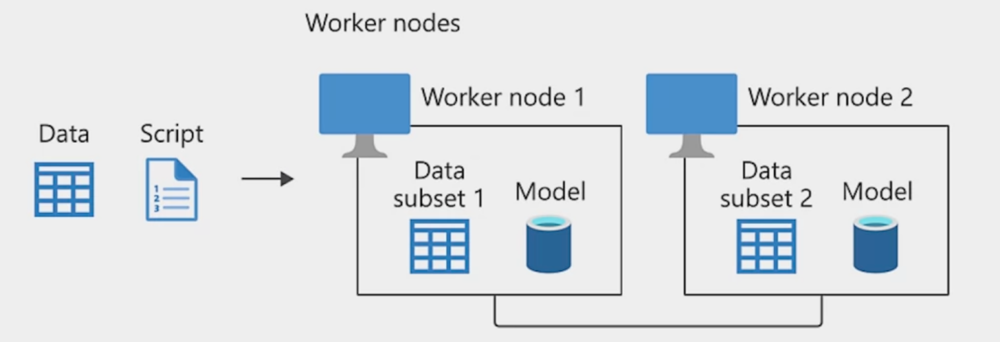
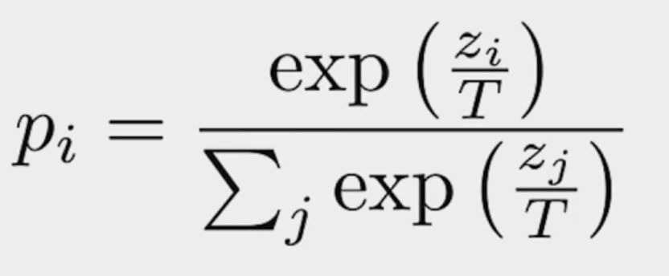

# Week 3 - High performance modeling 

## Distributed Training 
### Rise in computational requirements
* At first, training models is quick and easy
* Training models becomes more time-consuming
    * With more data
    * With larger models 
* Longer training -> More epochs -> Less efficient 
* Use distributed training approaches

### Types of distributed training 
####  1 - Data parallelism 
* **Data parallelism:** In data parallelism, models are replicated onto different accelerators (GPU/TPU) and data is split between them

##### Distributed training using **data parallelism**
* *Synchronous training* 
    * All workers train and complete updates in sync 
    * Supported via all-reduce architecture
* *Asynchronous training*
    * Each worker trains and completes updates separately 
    * Supported via parameter server architecture
    * More efficient, but can result in lower accuracy and slower convergence

#### 2 - Model parallelism
* **Model parallelism:** When models are too large to fit on a single device then they can be divided into partitions, assigning different partitions to different accelerators 

### Making your models distribute-aware 
* If you want to distribute a model:
    * Supported in high-level APIs such as Keras/Estimators
    * For more control, you can use custom training loops 

#### tf.distribute.Strategy
* Library in TensorFlow for running a computation in multiple devices
* Supports distribution strategies for high-level APIs like Keras and custom training loops
* Convenient to use with little or no code changes
* Distrbution strategies:
    * **A - One Device Strategy** 
    * **B - Mirrored Strategy**
    * **C - Parameter Server Strategy**
    * Multi-worker Mirrored Strategy 
    * Central Storage Strategy 
    * TPU Strategy 

#### A - One device Strategy 
* Single device - no distribution
* Typical usage of this strategy is testing your code before switching to other strategies that actually distribute your code

#### **B - Mirrored Strategy <!> <- IMPORTANT**
* This strategy is typically used for training on one machine with multiple GPUs
    * Creates a replica per GPU <> Variables are mirrored 
    * Weight updating is done using efficient cross-device communication algorithms (all-reduce algorithms) 

#### C - Parameter Server Strategy
* Some machines are designated as workers and others as parameter servers
    * Parameter servers store variables so that workers can perform computations on them 
* Implements asynchronous data parallelism by default 

### Fault tolerance 
* Catastrophic failures in one worker would cause failure of distribution strategies
* How to enable fault tolerance in case a worker dies? 
    * By restoring training state upon restart from job failure 
    * Keras implementation: `BackupAndRestore callback`

### High performance ingestion 
#### Why input pipelines? 
Data at times can't fit into memory and sometimes, CPUs are under-utilized in compute intensive tasks like training a complex model

You should avoid these inefficiencies so that you can make the most of the hardware available -> Use input pipelines

#### tf.data: Tensorflow Input pipeline

### Training Large Models - The Rise of Gient Neural Networks 
* In 2014, the ImageNet winner was GoogleNet with 4 mil.parameters and scoring a 74,8% top-1 accuracy
* In 2017, Squeeze-and-excitation networks achieved 82,7% top-1 accuracy with 145.8 mil.parameters

> **36 fold increase in the number of parameters in just 3 years!**

#### Issues training larger networks 
* GPU memory only increased by factor ~ 3
* Saturated the amount of memory available in Cloud TPUs
* Need for large-scale training of giant neural networks

#### Overcoming memory constraints
* Strategy #1 - Gradient Accumulation
    * Split batches into mini-batches and only perform backprop after whole batch
* Strategy #2 - Memory swap
    * Copy activations between CPU and memory, back and forth

#### Parallelism revisited 
* **Data parallelism:** In data parallelism, models are replicated onto different accelerators (GPU/TPU) and data is split between them
* **Model parallelism:** When models are too large to fit on a single device then they can be divided into partitions, assigning different partitions to different accelerators

#### Challenge keeping accelerators busy
* Accelerators have limited memory
* Model parallelism: large networks can be trained
    * But, accelerators compute capacity is underutilized 
* Data parallelism: train same model with different input data
    * But, the maximum model size an accelerator can support is limited 

    
#### Pipeline parallelism

> F: Forward propagation
> B: Backward propagation 

* Integrates both data and model parallelism:
    * Divide mini-batch data into micro-batches
    * Different workers work on different micro-batches in parallel
    * Allow ML models to have significantly more parameters 

#### GPipe - Key features 
* Open-source TensorFlow library (using Lingvo)
* Inserts communication primitives at the partition boundaries
* Automatic parallelism to reduce memory consumption
* Gradient accumulation across micro-batches, so that model quality is preserved
* Partitioning is heuristic based 

## Knowledge Distillation
### Teacher and Student Networks
#### Sophisticated models and their problems
* Larger sophisticated models become complex
* Complex models learn complex tasks
* Can we express this learning more efficiently 

Is it possible to `distill` or concentrate this complexity into smaller networks? 

##### GoogLeNet 

#### Knowledge distillation
* Duplicate the performance of a complex model in a simpler model 
* Idea: Create a simple `student` model that learns from a complex `teacher` model 

#### Teacher and student 
* Training objectives of the models vary
* Teacher (normal training)
* maximizes the actual metric
* Student (knowledge transfer)
    * matches p-distribution of the teacher's predictions to form 'soft targets'
    * 'Soft targets' tell us about the knowledge learned by the teacher 

#### Transferring "dark knowledge" to the student
* Improve softness of the teacher's distribution with 'softmax temperature' (T)
* As T grows, you get more insight about which classes the teacher finds similar to the predicted one 

#### Techniques
* Approach #1: **Weigh objectives** (student and teacher) and combine during backprop
* Approach #2: **Compare distributions of the predictions** (student and teacher) using KL divergence 

#### How knowledge transfer takes place

#### First quantitative results of distillation

| Model                  | Accuracy | Word Error Rate (WER) |
|------------------------|----------|-----------------------|
| Baseline               | 58.9%    | 10.9%                 |
| 10x ensemble           | 61.1%    | 10.7%                 |
| Distilled Single Model | 60.8%    | 10.7%                 |

### DistilBERT
* Uses 40% fewer parameters
* 60% faster
* 97% BERTs performance 

## Case study - How to distill knowledge for Q&A Task 

* [Knowledge distillation](https://arxiv.org/pdf/1503.02531.pdf)
* [Q&A case study](https://arxiv.org/pdf/1910.08381.pdf)