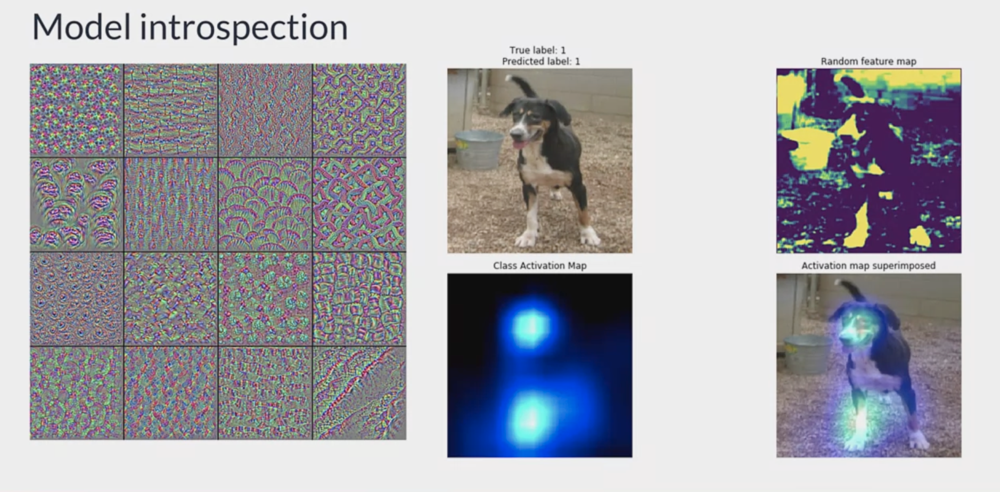
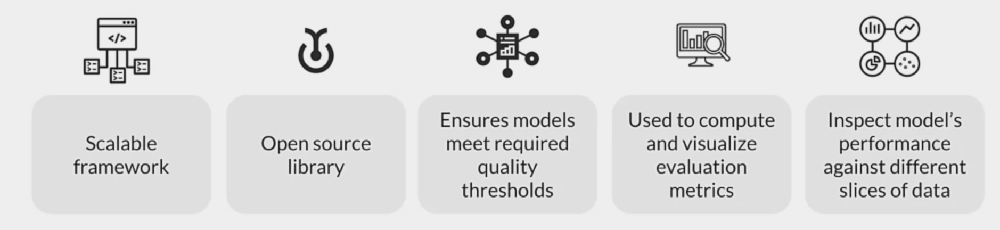

# Week 4 - Model Performance Analysis
## What is next after model training/deployment

* Is model performing well? 
* Is there scope for improvement?
* Can the data change in future?
* Has the data changed since you created your training dataset?

### Black box evalutaion vs model introspection
* Models can be tested for metrics like accuracy and losses like test error without knowing internal details
* For finer evaluation, models can be inspected part by part 

#### Black box - [TensorfBoard.dev](https://blog.tensorflow.org/2019/12/introducing-tensorboarddev-new-way-to.html):

#### Model introspection

### Performance metrics vs optimization objectives
#### Performance metrics
* Performance metrics will bary based on the task like regression, classification etc.
* Within a type of task, based on the end-goal, your performance metrics may be different
* Performance is measured after a round of optimization

#### Optimization Objectives
* Machine learning formulates the problem statement into an objective function
* Learning algorithms find optimum values for each variable to converge into local/global minima

> https://cs231n.github.io/neural-networks-3

#### Top level aggregate metrics vs slicing 
* Most of the time, metrics are calculated on the entire dataset
* Slicing deals with understanding how the model is performing on each subset of data

## TensorFlow Model Analysis - TFMA

### Why should you slice your data?
Your top-level metrics may hide problems
* Your model may not perform well for particular [customers | products | stores | day of the week | etc.]

Each prediction request is an individual event, maybe an individual customer
* For example, customers may have bad experience
* For example, some stores may perform badly

### Architecture - TFMA 

### One model vs multiple models over time

### Streaming vs full-pass metrics
* Streaming metrics are approximations computed on mini-batches of data
* TensorBoard visualizes metrics through mini-batches
* TFMA gives evaluation results after running through entire dataset
* Apache Beam is used for scaling on large datasets 

### TFMA in practice
* Analyse impact of different slices of data over various metrics
* How to track metrics over time? 

#### step 1 - Export EvalSavedModel for TFMA


#### step 2 - Create EvalConfig 


#### step 3 - Analyze model


#### Step 4 - Visualizing metrics
```python
tfma.viewer.render_slicing_metrics(result)
```

## Model Debugging Overview
### Model robustness 
* Robustness is much more than generalization
* Is the model accurate even for slightly corrupted input data? 

#### Robustness metrics 
* Robustness measurement shouldn't take place during training
* Split data in to train/val/dev sets
* Specific metrics for regression and classification problems

### Model debugging
* Deals with detecting and dealing with problems in ML systems
* Applies mainstream software engineering practices to ML models 

### Model debugging Objectives
* Opaqueness
* Social discrimination
* Security vulnerabilities
* Privacy harms
* Model decay

### Model debugging techniques
1. #### **Benchmark models**
    * Simple, trusted and interpretable models solving the same problem 
    * Compare your ML model against these models
    * Benchmark model is the starting point of ML development
2. #### **Sensitivity analisys and Adversarial attacks**
    * Stimulate data of your choice and see what your model predicts
    * See how model reacts to data which has never been used before
    * *What-If* tool for sensitive attacks

> Random attacks:
> * Expose models to high volumes of random input data
> * Exploits the unexpected software and maths bugs
> Great way to start debugging
> 
> Partial dependence plots
> * Visualize the effects of changing one or more variables in your model 
> PDPbox and PyCEbox open source packages

##### How vulnerable to attacks is your model? 
Sensitivity can mean vulnerability
    * Attacks are aimed at fooling your model 
    * Successful attacks could be catastrophic 
    * Test adversarial examples
    * Harden your model

##### A famous example of attack: Ostrich


##### How vulnerable to attacks is your model? 
Example: 
A self-driving car crashes because black and white stickers applied to a stop sign cause a classifier to interpred it as a Speed Limit 45 sign 

##### Measuring your vulnerability to attack
* *Cleverhans:*
    * An open-source Python library to benchmark machine learning systems vumnerability to adversarial examples
* *Foolbox:*
    * an open-source Python library that  lets you easily run adversarial attacks against machine learning models

##### Adversarial example searches
Attempted defenses against adversarial examples
* Defensive distillation
* 

3. #### **Residual analysis**
    * Measures the difference between models predictions and ground truth
    * Randomly distributed errors are good
    * Correlated or systematic errors show that a model can be improved
    * 
    *  Residuals should not be correlated with another feature
    *  Adjacent residuals should not be correlated with each other (autocorrelation)

### Model Remediation

#### Remediation techniques
* **Data augmentation** 
    * Adding synthetic data into training set
    * Helps correct for unbalanced training data 
* **Interpretable and explainable ML **
    * Overcome mytho of nn as black box 
    * Understand how data is getting transformed  
* **Model editing:**
    * Applies to decision trees
    * Manual tweaks to adapt your use case
* **Model assertions:**
    * Implement business rules that override model predictions
* **Model monitoring:**
    * Conduct model debugging at regular intervals
    * Inspect accuracy, fairness, security problems etc.
* **Anomaly detection:**
    * Anomalies can be a warning of an attack
    * Enforce data integrity constraints on incoming data


#### Discrimination remediation:
* Include people with varied background for collecting training data
* Conduct feature selection on training
* Use fairness metrics to select hyperparameters and decision cut-off thresholds

### Fairness
#### Fairness indicators
* Open source library to compute fairness metrics
* Easily scales across dataset of any size 
* Built in top of TFMA

#### What does fairness indicators do? 
* Compute commonly-identified fairness metrics for classification models
* Compare model performance across subgroups to other models 
* No remediation tools is needed

#### Evaluate at individual slices
* Overall metrics can hide poor performance for certain parts of data
* Some metrics may fare well over others

#### Aspects to consider
* Establish context and different user types 
* Seek domain experts help
* Use data slicing widely and wisely 

#### General guidelines
* Compute performance metrics at all slices of data
* Evaluate your metrics across multiple thresholds 
* If decisiion margin is small

### Measuring Fairness
#### Positive rate / Negative rate
* Percentage data points classified as positive/negative
* Indepeent of ground truth
* Use case: having equal final percentages of groups is important

#### True positive rate (TPR) / False negative rate (FNR)
* **TPR:** percentage of positive data points that are correctly labeled positive
* **FNR:** percentage of positive data points that are incorrectly labeled negative 
* Measures equality of opportunity, when the positive class should be equal across subgroups
* Usecase: where it is important that same percent of qualified candidates are rates positive in each group

#### True negative rate (TNR) / False positive rate (FPR)
* **TNR:** percentage of negative data points that are correctly labeled negative 
* **FPR:** percentage of negative data points that are incorrectly labeled positive 
* Measures equality of opportunity, when the negative class should be equal across subgroup
* Use case: where misclassifying something as positive are more concerning than classifiyng the postitives

### Accuracy & Area under the curve (AUC)
* **Accuracy:** The percentage of data points that are correctly labeled
* **AUC:** The percentage of data points that are correctly labeled when each class is given equal weight independent of number of samples
* Metrics related to predictive parity
* Use case: when precision is critical

#### Tips 
Unfair skews if there is a gap in a metric bewteen two groups

Good fainress indicators doesn't always mean the model is fair 

Continuous evaluation throughout developement and deployment 

Conduct adversarial testing for rare, malicious examples

### About the CelebA dataset
* 200K celebrity images
* Each image has 40 attribute annotations
* Each image has 5 landmark locations
* Assumption on smiling attribute

#### Fairness indicators in practice
1. Build a classifier to detect smiling
2. Evaluate fairness and performance across age groups
3. Generate visualizations to gain model performance insight 

## Model Monitoring
### Why do models need to be monitored?

* Training data is a snapshot of the world at a point in time
* Many types of data change over time, some quickly 
* ML models do not get better with age
* As model performance degrades, you want an early warning

### Data drift and shift
* **Concept drift:** loss of prediction quality
* **Concept emergence:** new type of data distribution
* **Types of dataset shift:**
    * Covariate shift
    * Prior probability shift

### How are model monitored? 


#### Statistical process control


#### Sequential analysis


#### Error distribution monitoring


#### Clustering/novelty detection
* Assign data to known cluster or detect emerging concept 
* Multiple algorithms: OLINDA, MINAS, ECSMiner and GC3
* Susceptible to curse of dimensionality

#### Feature distribution monitoring
* Monitors individual feature separately at every window of data
* Algorithms to compare:
    * Pearson correlation in Change of Concept
    * Hellinger Distance in HDDDM
* Use PCA to reduce number of features

#### Model-dependent monitoring
* Concentrate efforts near decision margin in latent space
* One algorithm is Margin Density Drift Detection (MD3)
* Area in latent space where classifiers have low confidence matter more
* Reduces false alarm rate effectively 

#### Google Cloud AI Continuous Evaluation
* Leverages AI Platform Prediction and Data Labeling services
* Deploy your model to AI Platform Prediction with model version
* Create evaluation job
* Input and output are saved in BigQuery table
* Run evaluation job on few of these samples
* View the evaluation in Google Cloud Console

### How often should you retrain?
* Depends on the rate of change
* If possible, automate the management of detecting model drift and triggering model retraining

### Continuous Evaluation and Monitoring 
* [Instrumentation, Observation & Monitoring of ML models](https://www.infoq.com/presentations/instrumentation-observability-monitoring-ml/)
* [Monitoring ML models in Prod - A comprehensive Guide](https://christophergs.com/machine%20learning/2020/03/14/how-to-monitor-machine-learning-models/)
* [Concept drift detection for Unsupervised Learning](https://arxiv.org/pdf/1704.00023.pdf)
