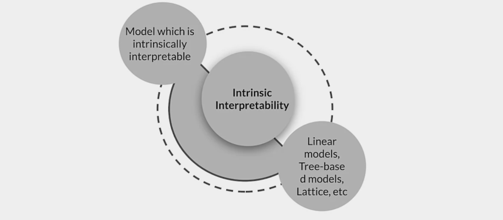

# Week 5 - Interpretability 
## Explainable AI

### Responsible AI 
* Development of AI is creating new opportunities to improve lives of people 
* Also raises new questions about the best way to build the following into AI systems:

| Fairness                                                                | Explainability                                               | Privacy                                                                  | Security                                                               |
|-------------------------------------------------------------------------|--------------------------------------------------------------|--------------------------------------------------------------------------|:-----------------------------------------------------------------------|
| Ensure working towards systems that are fair and inclusive to all users | Understanding how and why ML models make certain predictions | Training models using sensitive data needs privacy preserving safeguards | Identifying potential threats can help kepp AI systems safe and secure |
| Explainability helps ensure fairness                                    | Explainability helps ensure fairness                         |                                                                          |                                                                        |

### Explainable Artificial Intelligence (XAI)
The filed of XAI allow ML system to be more transparent, providing explanations of their decisions in some level of detail

These explanations are important:
* To ensure algorithms fairness
* Identify potential bias and problems in training data
* To ensure algorithms/models work as espected

### Need for Explainability in AI
1. Models with high sensitivity, including natural language networks, can generate wildly wrong results
2. Attacks
3. Fairness
4. Reputation and Branding
5. Legal and regulatory concerns
6. Custormers and other stakeholders may question or challenge model decisions

### Deep Neural Networks (DNNs) can be fooled

## Interpretability 
### Model Interpretation Methods
##### What is interpretability?
*"(Models) are interpretable if their operations can be understood by a human, either though introspection or through a produced explanation."* - O.Biran, C.Cotton

##### What are the requirements?
* You should be able to query the model to understand:
    * Why did the model behave in a certain way?
    * How can we trust the predictions made by the model?
    * What information can model provide to avoid prediction errors?

#### Categorizing Model Interpretation Methods

#### Intrinsic or Post-Hoc?

* Post-hoc methods treat models as black boxes
* Agnostic to model architecture 
* Extracts relationships between features and model predictions, agnostic of model architecture 
* Applied after training

#### Types of results produced by Interpretation Methods
* Feature Summary Statistics 
* Feature Summary Visualization
* Models Internals
* Data point

#### Model Specific or Model Agnostic

### Interpretability of ML Models

#### Local or Global?
* **Local:** interpretation method explains an individual prediction
* Feature attribution is identification of relevent features as an explanation for a model

* **Global:** interpretation method explains entire model behaviour
* Feature attribution summary for the entire test dataset

### Intrinsically Interpretable Models
* How the model works is self evident
* Many classic models are highly interpretable
* Neural networks look like "black boxes"
* Newer architectures focus on designing for interpretability

#### Monotonicity improves interpretability

### Interpretable Models

| Algorithm           | Linear | Monotonic | Feature Interaction | Task       |
|---------------------|:-------|:----------|---------------------|------------|
| Linear Regression   | Yes    | Yes       | No                  | regr       |
| Logistic Regression | No     | Yes       | No                  | class      |
| Decision trees      | No     | Some      | Yes                 | class,regr |
| RuleFit             | Yes*   | No        | Yes                 | class,regr |
| K-nearest neighbors | No     | No        | No                  | class,regr |
| TF Lattice          | Yes*   | Yes       | Yes                 | class,regr |

#### Model architecture Influence on Interpretability

#### Interpretation from Weights
Linear models have easy to understand interpreation from weights
* **Numerical features:** Increase of one unit in a feature increases prediction by the value of corresponding weights
* **Binary features:** Changing between 0 or 1 category changes the prediction by value of the feature's weight
* **Categorical features:** one hot encoding affects only one weight

#### Feature importance
* Relevance of a given feature to generate model results
* Calculation is model dependent
* Example: linear regression model, t-statistic

### More advanced models: TensorFlow Lattice
* Overlaps a grid onto the feature space and learns values for the output at the vertices of the grid
* Linearly interpolates from the lattice values surrounding a point

* Enables you to **inject domain knowledge** into the learning process through common-sense or policy-driven shape constraints
* Set constraints such as monotonicity, convexity, and how features interact

#### TF Lattice: Accuracy
* TF Lattice achieves accuracies comparable to neural networks
* TF Lattice provides greater interpretability

#### TF Lattice: Issues
**Dimensionality**
* The number of parameters of a lattice layer **increases exponentially** with the number of input features
* Very rough Ryle: Less than 20 features ok without ensembling

## Model Agnostic Methods
These methods separate explanations from the ml models

Desired characteristics:
* Model flexibility 
* Explanation flexibility 
* Representation flexibility

### Partial Dependence Plots (PDP)

* The marginal effect one or two features have on the model result
* Whether the relationship between the targets and the feature is linear, monotonic or more complex 

The partial function fxs is estimated by calculating averages in the training data:

* Computation is intuitive 
* If the feature whose PDP is calculated has no feature correlations, PDP perfectly represents how feature influences the prediction on average
* Easy to implement

But:
* Realistic maximum number of features in PDP is 2 
* PDP assumes that feature values have no interactions

### Permutation Feature Importance
Feature importance measures the increase in predictioon error after permuting the features:

Feature is **important** if:
* Shuffling its values increases model error

Feature is **unimportant** if:
* Shufflinf its values leaves model error unchanged

#### PFI
* Estimate the original model error
* For each feature:
    * Permute the feature values in the data to break its association with the true outcome
    * Estimate error based on the predictions of the permuted data
    * Calculate permutation feature importance
    * Sort features by descending feature importance

    
#### Advantages of Permutation feature importance
* Nice interpretation: Shows the increase in model error when the features information is destroyed
* Provides global insight to model's behaviour
* Does not require retraining of model

#### Disadvantages
* It is unclear if testing or training data should be used for visualization 
* Can be biased since it can create unlikely feature combinations in case of strongly correleated features
* You need access to the labeled data

### Shapley Values
* The Shapley value is a method for assigning payouts to players depending on their contribution to the total
* Applying that to ML we define that:
    * Feature is a "player" in a game
    * Prediction is the "payout"
    * Shapley value tells us how the "payout" (feature contribution) can be distributed among features

| Term in Game Theory | Relation to ML                                                      | Relation to House prices Example                                                    |
|---------------------|:--------------------------------------------------------------------|-------------------------------------------------------------------------------------|
| Game                | Prediction task for single instance of dataset                      | Prediction of house prices for a single instance                                    |
| Gain                | Actual prediction for instance-Average prediction for all instances | Prediction for house price ($300,000) - Average Prediction ($310,000) = - ($10,000) |
| Players             | Feature values that contribute to prediction                        | 'Park=nearby', 'cat=banned','area=50m2', 'floor=2nd'                                |

#### Advantages
* Based on solid theoretical foundation.
* Satisfies Efficiency, Symmetry, Dummy, and Activity properties

* Value is fairly distributed among all features

* Enables contrastive explanations

#### Disadvantages
* Computationally expensive
* Can be easily misinterpreted
* Always uses all the features, so not good for explanations of only a few features.
* No prediction model.
* Does not work well when features are correlated 

### SHAP (SHapley Additive exPlanations)
* SHAP is a framework for Shapley Values which assigns each feature an importance value for a particular prediction 
* Includes extensions for:
    * TreeExplainer: high-speed exact algorithm for tree ensembles
    * DeepExplainer: high-speed approximation algorithm for SHAP values in deep learning models 
    * GradientExplainer: combines idea from Integrated Gradients, SHAP, and SmoothGrad into a single expected value equation 
    * KernelExplainer: uses a specially-weighted local linear regression to estimate SHAP values for any model

#### SHAP Explanation Force Plots

* Shapley values can bed visualized as forces
* Prediction starts from the baseline (Average of all predictions)
* Each feature value is a force that increases (red) or decreases (blue) the prediction 

 

### Testing Concept Activation Vectors (TCAV)

Concept Activation Vectors (CAVs)
* A neural network's internal state in terms of human-friendly concepts
* Defined using examples which show the concept

#### Example concepts

### LIME
#### Local Interpretation Model-agnostic Explanations (LIME)

* Implements local surrogate models - interpretable models that are used to explain individual predictions
* Using data points close to the individual prediction, LIME trains an interpretable model to approximate the predictions of the real model 
* The new interpretable model is then used to interpret the real result

### AI Explanations
#### Google Cloud AI explanations for AI Platform

* **Explain** why an individual data point received that prediction
* **Debug** odd behaviour from  a model
* **Refine** a model or data collection process
* **Verify** that the model's behavior is acceptable
* **Present** the gist of the model

A gradients-based method to efficiently compute feature attributions with the same axiomatic properties as Shapley values

#### AI Explanations: XRAI (eXplanation with Ranked Area Integrals) 

XRAI assesses overlapping regions of the image to create a saliency map
* Highlights relevant regions of the image rather than pixels
* Aggregates the pixel-level attribution within each segment and ranks the segments

**** 
Machine Learning Modeling Pipelines in Production

This is a compilation of resources including URLs and papers appearing in lecture videos. If you wish to dive more deeply into the topics covered this week, feel free to check out these optional references.

Overall resources:

Towards ML Engineering - History of TFX: 

https://arxiv.org/abs/2010.02013

Challenges in Deploying ML:

https://arxiv.org/abs/2011.09926

Week 1: Neural Architecture Search

Neural Architecture Search:

https://arxiv.org/pdf/1808.05377.pdf

Bayesian Optimization:

https://distill.pub/2020/bayesian-optimization/

Neural Architecture Search with Reinforcement Learning:

https://arxiv.org/pdf/1611.01578.pdf

Progressive Neural Architecture Search:

https://arxiv.org/pdf/1712.00559.pdf

Network Morphism:

https://arxiv.org/abs/1603.01670

Amazon SageMaker Autopilot

https://aws.amazon.com/sagemaker/autopilot

Microsoft Azure Automated Machine Learning

https://azure.microsoft.com/en-in/services/machine-learning/automatedml/

Google Cloud AutoML

https://cloud.google.com/automl

Week 2: Model Resource Management Techniques

High dimensional spaces visualization:

https://colab.research.google.com/drive/1GTBYAcMsiKDDQeDpyOIi_DGuPVleJAf0?usp=sharing

Word embeddings:

https://heartbeat.fritz.ai/coreml-with-glove-word-embedding-and-recursive-neural-network-part-2-d72c1a66b028

Curse of dimensionality:

https://builtin.com/data-science/curse-dimensionality

https://www.visiondummy.com/2014/04/curse-dimensionality-affect-classification/

Sparsity:

https://www.kdd.org/exploration_files/parsons.pdf

Feature engineering:

https://quantdare.com/what-is-the-difference-between-feature-extraction-and-feature-selection/

https://machinelearningmastery.com/discover-feature-engineering-how-to-engineer-features-and-how-to-get-good-at-it/

PCA:

https://scikit-learn.org/stable/modules/decomposition.html

https://www.coursera.org/lecture/machine-learning/principal-component-analysis-problem-formulation-GBFTt

https://stats.stackexchange.com/questions/2691/making-sense-of-principal-component-analysis-eigenvectors-eigenvalues/140579#140579

https://elitedatascience.com/dimensionality-reduction-algorithms

ICA:

https://scikit-learn.org/stable/modules/decomposition.html

https://scikit-learn.org/stable/auto_examples/decomposition/plot_ica_vs_pca.html

NMF:

https://scikit-learn.org/stable/modules/decomposition.html#non-negative-matrix-factorization-nmf-or-nnmf

Mobile model deployment:

https://developers.google.com/ml-kit

https://www.tensorflow.org/lite

Quantization:

https://www.qualcomm.com/news/onq/2019/03/12/heres-why-quantization-matters-ai

https://petewarden.com/2016/05/03/how-to-quantize-neural-networks-with-tensorflow/

https://arxiv.org/abs/1712.05877

https://blog.tensorflow.org/2020/04/quantization-aware-training-with-tensorflow-model-optimization-toolkit.html

https://www.tensorflow.org/lite/performance/best_practices

Post-training quantization:

https://medium.com/tensorflow/introducing-the-model-optimization-toolkit-for-tensorflow-254aca1ba0a3

Quantization aware training:

https://blog.tensorflow.org/2020/04/quantization-aware-training-with-tensorflow-model-optimization-toolkit.html

Pruning:

https://blog.tensorflow.org/2019/05/tf-model-optimization-toolkit-pruning-API.html

http://yann.lecun.com/exdb/publis/pdf/lecun-90b.pdf

https://towardsdatascience.com/can-you-remove-99-of-a-neural-network-without-losing-accuracy-915b1fab873b

https://arxiv.org/abs/1803.03635

https://numenta.com/blog/2019/08/30/case-for-sparsity-in-neural-networks-part-1-pruning

https://www.tensorflow.org/model_optimization/guide/pruning

Week 3: High Performance Modeling

Distribution strategies:

https://www.tensorflow.org/guide/distributed_training

Changes in data parallelism:

https://arxiv.org/abs/1806.03377

Pipeline parallelism:

https://ai.googleblog.com/2019/03/introducing-gpipe-open-source-library.html

GPipe:

https://github.com/tensorflow/lingvo/blob/master/lingvo/core/gpipe.py

https://arxiv.org/abs/1811.06965

GoogleNet:

https://arxiv.org/abs/1409.4842

Knowledge distillation:

https://ai.googleblog.com/2018/05/custom-on-device-ml-models.html

https://arxiv.org/pdf/1503.02531.pdf

https://nervanasystems.github.io/distiller/knowledge_distillation.html

DistilBERT:

https://blog.tensorflow.org/2020/05/how-hugging-face-achieved-2x-performance-boost-question-answering.html

Two-stage multi-teacher distillation for Q & A:

https://arxiv.org/abs/1910.08381

EfficientNets:

https://arxiv.org/abs/1911.04252

Week 4: Model Performance Analysis

TensorBoard:

https://blog.tensorflow.org/2019/12/introducing-tensorboarddev-new-way-to.html

Model Introspection:

https://www.kaggle.com/c/dogs-vs-cats/data

Optimization process:

https://cs231n.github.io/neural-networks-3/

TFMA architecture:

https://www.tensorflow.org/tfx/model_analysis/architecture

TFMA:

https://blog.tensorflow.org/2018/03/introducing-tensorflow-model-analysis.html

Aggregate versus slice metrics:

https://blog.tensorflow.org/2018/03/introducing-tensorflow-model-analysis.html

What-if tool:

https://pair-code.github.io/what-if-tool/

https://www.google.com/url?q=https://www.youtube.com/playlist?list%3DPLIivdWyY5sqK7Z5A2-sftWLlbVSXuyclr&sa=D&source=editors&ust=1620676474220000&usg=AFQjCNEF_ONMs8YkdUtgUp2-stfKmDdWtA

Partial Dependence Plots:

https://github.com/SauceCat/PDPbox

https://github.com/AustinRochford/PyCEbox

Adversarial attacks:

http://karpathy.github.io/2015/03/30/breaking-convnets/

https://arxiv.org/pdf/1707.08945.pdf

Informational and behavioral harms:

https://fpf.org/wp-content/uploads/2019/09/FPF_WarningSigns_Report.pdf

Clever Hans:

https://github.com/cleverhans-lab/cleverhans

Foolbox:

https://foolbox.jonasrauber.de/

Defensive distillation:

https://arxiv.org/abs/1511.04508

Concept Drift detection for Unsupervised Learning: 

https://arxiv.org/pdf/1704.00023.pdf

Cloud providers:

https://cloud.google.com/ai-platform/prediction/docs/continuous-evaluation

https://aws.amazon.com/sagemaker/model-monitor

https://docs.microsoft.com/en-us/azure/machine-learning/how-to-monitor-datasets

Fairness:

https://www.tensorflow.org/responsible_ai/fairness_indicators/guide

Model Remediation: 

https://www.tensorflow.org/responsible_ai/model_remediation

AIF360:

http://aif360.mybluemix.net/

Themis ML:

https://github.com/cosmicBboy/themis-ml

LFR: 

https://arxiv.org/pdf/1904.13341.pdf

Week 5: Explainability

Fooling DNNs:

https://arxiv.org/pdf/1607.02533.pdf

https://arxiv.org/pdf/1412.6572.pdf

XAI:

http://www.cs.columbia.edu/~orb/papers/xai_survey_paper_2017.pdf

Interpretable models

https://christophm.github.io/interpretable-ml-book/

https://www.tensorflow.org/lattice

Dol bear law:

https://en.wikipedia.org/wiki/Dolbear%27s_law

TensorFlow Lattice:

https://www.tensorflow.org/lattice

https://jmlr.org/papers/volume17/15-243/15-243.pdf

PDP: 

https://github.com/SauceCat/PDPbox

https://scikit-learn.org/stable/auto_examples/inspection/plot_partial_dependence.html

Permutation Feature Importance:

http://arxiv.org/abs/1801.01489

Shapley values:

https://en.wikipedia.org/wiki/Shapley_value

SHAP:

https://github.com/slundberg/shap

 TCAV:

https://arxiv.org/pdf/1711.11279.pdf

 LIME:

https://github.com/marcotcr/lime

Google Cloud XAI

https://storage.googleapis.com/cloud-ai-whitepapers/AI%20Explainability%20Whitepaper.pdf

Integrated gradients:

https://arxiv.org/pdf/1703.01365.pdf

